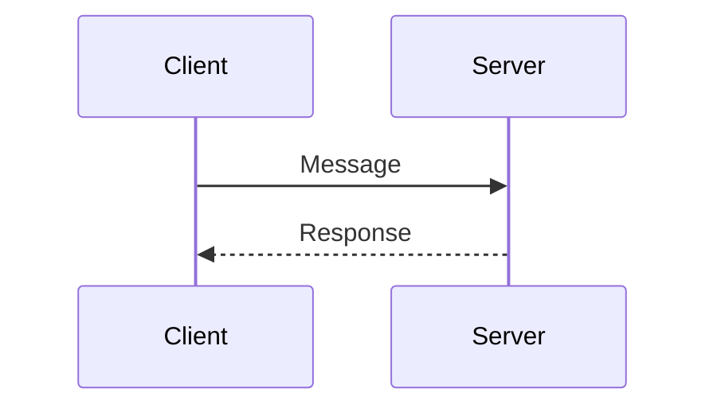
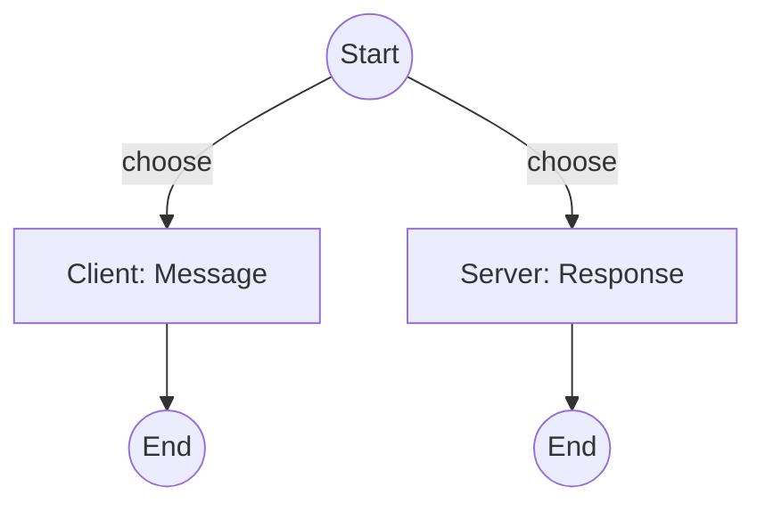
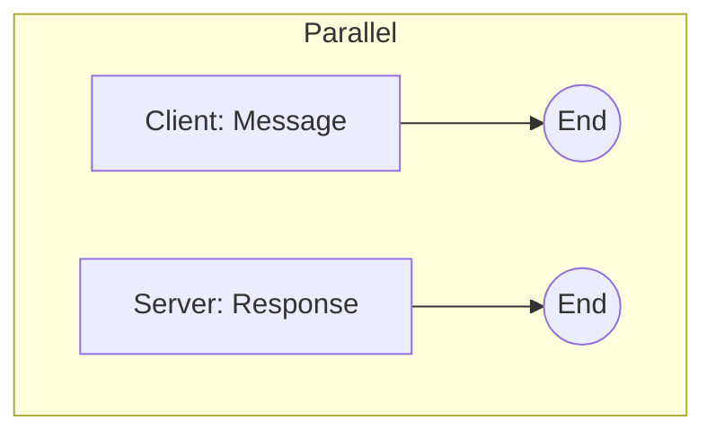

# Besedarium

Welcome to the Session Types Playground! This project is a Rust library for building, composing,
and verifying communication protocols at the type level. If you've ever wanted to make sure your
distributed systems or networked applications follow the right message flow—at compile time—this
is for you.

## Background: Session Types

Session types provide a formal, type-based approach to describing and verifying communication
protocols between concurrent or distributed processes. By encoding the permitted sequences of
message exchanges in types, they guarantee properties such as protocol fidelity, progress, and
deadlock freedom.

Key research works:

- K. Honda, V. T. Vasconcelos, M. Kubo. "Language primitives and type discipline for structured
  communication-based programming." ESOP '98.
- N. Yoshida, M. H. Carbone. "Multiparty asynchronous session types." POPL '15.
- R. Gay and N. Vasconcelos. "Linear type theory for asynchronous session types." JFP '10.

Notable implementations:

- Rust:
  - besedarium (this library)
  - `session-types` crate
  ([<https://crates.io/crates/session-types](https://crates.io/crates/session-types>))
- Scala:
  - Effpi library ([<https://github.com/effpi/effpi](https://github.com/effpi/effpi>))
- Haskell:
  - `session` package
  ([<https://hackage.haskell.org/package/session](https://hackage.haskell.org/package/session>))

## What is this?

Session types let you describe the structure of conversations between different parts of your
system. With this library, you can:

- Define protocols as types (like a handshake, a publish/subscribe, or a workflow)
- Compose protocols using ergonomic macros
- Get helpful compile-time errors if you make a mistake (like mixing up roles or leaving out a
  branch)
- See real-world protocol examples in the `tests/protocols/` folder

## Why should I care?

- **Catch protocol mistakes early:** No more runtime surprises when two services disagree on what
  comes next.
- **Readable and reusable:** Protocols are just Rust types—easy to read, share, and reuse.
- **Great for learning:** The examples and tests are designed to be easy to follow, so you can
  learn session types by example.

## How do I use it?

1. Add this crate to your project (see [Cargo.toml](Cargo.toml)).
2. Define your roles and messages as Rust types.
3. Use the provided macros (`tchoice!`, `tpar!`, etc.) to build your protocol.
4. Check out the examples in `tests/protocols/` for inspiration.

## Example: Client-Server Handshake

```rust
use besedarium::*;
struct L; impl ProtocolLabel for L {}
type Handshake = TInteract<Http, L, TClient, Message, TInteract<Http, L, TServer, Response, TEnd<Http, L>>>;
```



## Example: N-ary Choice

```rust
use besedarium::*;
struct L1; impl ProtocolLabel for L1 {}
struct L2; impl ProtocolLabel for L2 {}
type Choice = tchoice!(Http;
    TInteract<Http, L1, TClient, Message, TEnd<Http, L1>>,
    TInteract<Http, L2, TServer, Response, TEnd<Http, L2>>,
);
```



## Example: Parallel Composition

```rust
use besedarium::*;
struct L1; impl ProtocolLabel for L1 {}
struct L2; impl ProtocolLabel for L2 {}
type Par = tpar!(Http;
    TInteract<Http, L1, TClient, Message, TEnd<Http, L1>>,
    TInteract<Http, L2, TServer, Response, TEnd<Http, L2>>,
);
```



## Projection: From Global to Local Session Types

The projection machinery in Besedarium allows you to derive the local (endpoint) session type
for a given role from a global protocol specification.

## How it works

- The `ProjectRole` trait recursively traverses a global protocol (a type implementing `TSession`)
  and produces the local protocol for a specific role.
- Each global combinator (`TInteract`, `TChoice`, `TPar`, etc.) has a corresponding endpoint type
  (`EpSend`, `EpRecv`, `EpChoice`, `EpPar`, etc.).
- Helper traits (e.g., `ProjectInteract`, `ProjectChoice`, `ProjectPar`) are used to avoid
  overlapping trait impls and to dispatch on type-level booleans.

## Example

```rust
use besedarium::*;
struct Alice; impl Role for Alice {}; impl ProtocolLabel for Alice {};
struct Bob; impl Role for Bob {}; impl ProtocolLabel for Bob {};
impl RoleEq<Alice> for Alice { type Output = True; }
impl RoleEq<Bob> for Alice   { type Output = False; }
impl RoleEq<Alice> for Bob   { type Output = False; }
impl RoleEq<Bob> for Bob     { type Output = True; }
struct L; impl ProtocolLabel for L {}

type Global = TInteract<
    Http,
    EmptyLabel,
    Alice,
    Message,
    TInteract<Http, EmptyLabel, Bob, Response, TEnd<Http, EmptyLabel>>
>;

// Project onto Alice and Bob
type AliceLocal = <() as ProjectRole<Alice, Http, Global>>::Out;
type BobLocal   = <() as ProjectRole<Bob,   Http, Global>>::Out;

// Alice should send then receive
assert_type_eq!(
    AliceLocal,
    EpSend<
        Http,
        EmptyLabel,
        Alice,
        Message,
        EpRecv<
            Http,
            EmptyLabel,
            Alice,
            Response,
            EpEnd<Http, EmptyLabel, Alice>
        >
    >
);
```

See the protocol examples in `tests/protocols/` for more details.

## Where do I find more?

- **Protocol examples:** See `tests/protocols/` for real-world patterns.
- **Negative tests:** See `tests/trybuild/` for compile-fail cases and macro edge cases.
- **Docs:** Build and read the docs with `cargo doc --open`.

## Contributing

Contributions, questions, and protocol ideas are welcome! Open an issue or PR, or just try out
the library and let us know what you think.

---

*Session Types Playground: making protocols safer, one type at a time.*
