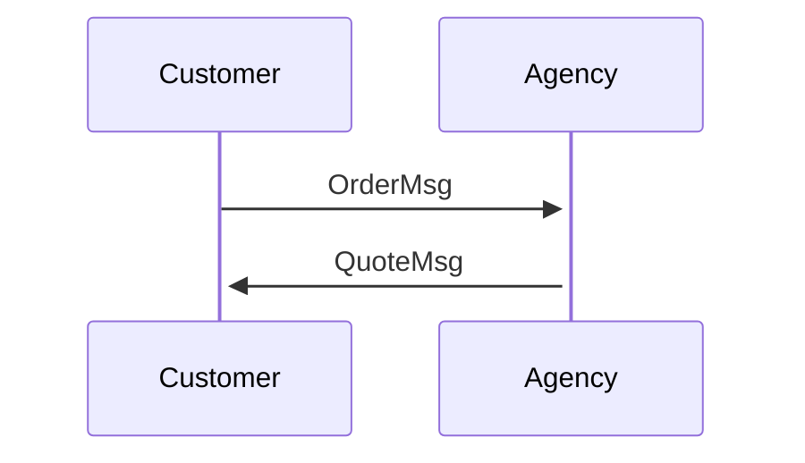

# Besedarium

**Besedarium** is a production-ready Rust library for building, verifying, and executing communication protocols with **compile-time safety** and **automatic documentation generation**. Using advanced session types and derive macros, it ensures your distributed systems and networked applications follow correct message flows—catching protocol violations before they reach production.

## ✨ Key Features

- 🔒 **Type-Level Protocol Safety**: Protocols defined as Rust types with compile-time verification
- 🚀 **Derive Macro System**: Automatic implementation generation with `#[derive(GlobalProtocol, Role, Message)]`
- 📊 **Documentation for Free**: Automatic Mermaid sequence diagram generation with `#[derive(GenerateDiagram)]`
- 🔄 **Dual Protocol Generation**: Automatic generation of protocol duals for role symmetry
- ⚡ **Robust Runtime System**: Async execution with graceful shutdown, resource tracking, and error recovery
- 🎯 **Advanced DSL**: Attribute macros for elegant protocol definition syntax
- 🧪 **Comprehensive Testing**: 256+ tests ensuring reliability and correctness

## 🚀 Quick Start

Add Besedarium to your `Cargo.toml`:

```toml
[dependencies]
besedarium = "0.1"

[features]
derive = ["besedarium/derive"]  # Enable derive macros
```

### Define Your First Protocol

```rust
use besedarium::prelude::*;

// Define roles
#[derive(Role, Clone, Debug)]
struct Customer;

#[derive(Role, Clone, Debug)]  
struct Agency;

// Define messages
#[derive(Message, Clone, Debug)]
struct OrderMsg(String);

#[derive(Message, Clone, Debug)]
struct QuoteMsg(u32);

// Define protocol with automatic documentation
#[derive(GlobalProtocol, GenerateDiagram)]
#[protocol(
    roles(Customer, Agency),
    io_type = "BiDirectionalAction"
)]
struct CustomerAgencyProtocol {
    // Customer sends order, Agency responds with quote
    step1: TChanSend<DefaultChan, OrderMsg, Customer, Agency, BiDirectionalAction>,
    step2: TChanRecv<DefaultChan, QuoteMsg, Agency, Customer, BiDirectionalAction>,
    end: TChanEnd<DefaultChan, DefaultMessage, BiDirectionalAction>,
}
```

The `#[derive(GenerateDiagram)]` automatically generates this Mermaid sequence diagram in your documentation:


```mermaid
sequenceDiagram
    participant Customer as Customer
    participant Agency as Agency
    Customer->>+Agency: OrderMsg
    Agency->>+Customer: QuoteMsg
```

## 🔍 Core Concepts

### Session Types Background

Session types provide a formal, type-based approach to describing and verifying communication protocols between concurrent or distributed processes. Key research includes:

- **Honda, Vasconcelos, Kubo**: "Language primitives and type discipline for structured communication-based programming" (ESOP '98)
- **Yoshida, Carbone**: "Multiparty asynchronous session types" (POPL '15)  
- **Gay, Vasconcelos**: "Linear type theory for asynchronous session types" (JFP '10)

### Protocol Components

- **Global Protocols**: Define the overall communication structure between all participants
- **Local Endpoints**: Project global protocols to individual participant views
- **Duality Verification**: Automatic checking that protocol participants are compatible
- **Runtime Execution**: Safe async execution with comprehensive error handling

## 🛠️ Advanced Features

### Automatic Dual Generation

```rust
#[derive(GlobalProtocol)]
#[protocol(
    roles(Client, Server),
    generate_dual = true,
    dual_name = "ServerClientProtocol"
)]
struct ClientServerProtocol {
    // Original protocol definition
}

// Automatically generates the dual protocol for Server-side perspective
```

### DSL for Complex Protocols

```rust
#[protocol]
struct WebServiceProtocol {
    #[role(display_name = "WebClient")]
    client: Client,
    
    #[role(display_name = "APIGateway")]  
    gateway: Gateway,
    
    #[session_type]
    flow: "
        Client -> Gateway: HttpRequest,
        Gateway -> Backend: ProcessRequest,
        Backend -> Gateway: Response,
        Gateway -> Client: HttpResponse
    "
}
```

### Runtime Safety Features

- **Graceful Shutdown**: Configurable timeout-based termination
- **Resource Tracking**: Automatic detection and cleanup of leaked resources
- **Deadlock Detection**: Runtime analysis of potential deadlock conditions
- **Error Recovery**: Comprehensive error handling with recovery suggestions

## 📚 Examples and Documentation

### Working Examples

Check out `examples/verify_protocol_examples.rs` for real-world protocol patterns:

- Customer-Agency simple protocols
- Multi-party web service communication  
- Complex choice and branching patterns
- Automatic diagram generation demos

### Comprehensive Testing

- **256+ Unit Tests**: Core protocol and duality verification
- **Integration Tests**: Multi-party protocol execution
- **Derive Macro Tests**: Complete macro functionality validation
- **Runtime Tests**: Async execution and error handling

### Documentation

- Build documentation: `cargo doc --open`
- **Core Concepts**: `docs/duality.md` - Complete implementation guide
- **Protocol Examples**: `docs/protocol-examples.md` - Real-world patterns
- **Runtime Patterns**: `docs/runtime-implementation-patterns.md`

## 🔧 Development Status

**Besedarium is feature-complete and production-ready** with:

- ✅ **Core Protocol System**: Complete type-level protocol safety (Task 1.1-1.4)
- ✅ **Comprehensive Testing**: 256+ tests covering all functionality (Task 2.1-2.5)  
- ✅ **Advanced Features**: Derive macros, DSL, visualization tools (Task 3.1-3.5)
- ✅ **Runtime System**: Async execution with full lifecycle management
- ✅ **Documentation Generation**: Automatic Mermaid diagrams and protocol docs

All major development phases are complete with extensive test coverage and production-ready implementations.

## 🤝 Contributing

Contributions, questions, and protocol ideas are welcome! 

- **Open an Issue**: Bug reports, feature requests, or questions
- **Submit a PR**: Code improvements, documentation, or examples  
- **Protocol Examples**: Share interesting protocol patterns you've implemented

## 📖 Related Projects

- **Rust**: [`session-types`](https://crates.io/crates/session-types) crate
- **Scala**: [Effpi library](https://github.com/effpi/effpi)
- **Haskell**: [`session`](https://hackage.haskell.org/package/session) package

---

***Besedarium: Type-safe protocols with documentation for free.***
