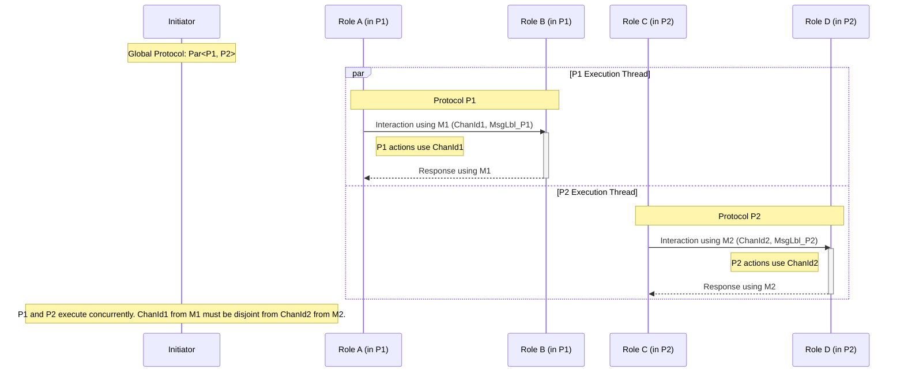

# Duality in MPST: Ensuring Correct Multiparty Interactions

This document explores the fundamental concept of **duality** in Multiparty Session Types (MPST). Duality is a critical property that ensures Global Protocols are correctly specified from the perspectives of all participating roles. A Global Protocol is considered well-formed if, for every communication action, the action of one participant is precisely matched by a complementary (dual) action of its counterpart.

We delve into the definitions of core protocol constructs (Send, Receive, Offer, Choice, Parallel, Sequential, Recursion, etc.) and meticulously detail their duality rules. A key focus is the integration of **Explicit Channel Identifiers (ECIs)** through a `CommMetadata` struct. This `CommMetadata` (often referred to simply as `M` in type definitions) provides greater precision in defining and verifying communication pathways, especially in complex protocols with multiple concurrent interactions or several distinct channels between the same pair of roles.

The document will cover:

- The motivation and mechanics of `CommMetadata` (containing `ChanId` and `MsgLbl`) for unambiguous channel and message identification.
- Detailed semantics, `CommMetadata` integration, and duality rules for each core MPST construct. This includes Global Types (e.g., `TChanSend<S, R, M, Msg, P>`, where `Msg` is the explicit message type) and their Local Endpoint Type projections (e.g., `EpSend<IO, M, Msg, P>`). Local Endpoint Types (`Ep*`) consistently use an `IO` generic parameter, typically representing session-specific context, I/O capabilities (e.g., input-only, output-only, or bidirectional), or an effects system. Its precise nature can vary with the specific MPST library implementation, but its consistent use is vital for type safety at the local level.
- The `IsDual` predicate, which formalizes the conditions for two protocol specifications to be duals of each other, incorporating `CommMetadata`, message types, and consistent `IO` capabilities.
- The concept of well-formedness and how it relies on duality to guarantee safe and coherent multiparty interactions.
- Examples illustrating how these concepts apply in practice, including scenarios with three or more roles.

By understanding duality and the role of `CommMetadata`, protocol designers can create more robust, verifiable, and maintainable MPST specifications.

## Motivation: Why Duality and Well-Formedness Matter

Duality and well-formedness are foundational concepts in the theory and practice of session types, especially in the context of MPST. They ensure that communication protocols (Global Protocols) are safe, deadlock-free, and free from mismatches or orphan messages.

- **Duality** guarantees that for every communication action (Send/Receive, Offer/Choice) between two roles, the actions are complementary: what one party sends, the other receives, and vice versa. This property is essential for ensuring that messages are neither lost nor duplicated, and that the protocol can progress without deadlock.

- **Well-formedness** extends this idea to the entire Global Protocol, especially in the multiparty setting. It ensures that all roles, when projected from the Global Protocol to their Local Endpoint Types, are pairwise compatible (dual) with respect to their shared actions. This prevents subtle bugs that can arise from misaligned expectations between participants.

Together, these properties:

- Guarantee that the protocol is implementable and safe.
- Prevent runtime errors due to communication mismatches.
- Enable static verification of protocol correctness at compile time.

## Relationship Between Duality and Well-Formedness

- **Duality** is a local property between two roles: it checks that their local types are compatible for their shared actions.
- **Well-formedness** is a global property: it requires that all pairs of communicating roles in the protocol are duals with respect to their shared actions.
- Thus, well-formedness is defined in terms of pairwise duality across all communicating pairs in the protocol.

## Implementing `IsDual()` and `IsWellFormed()`

- **IsDual(P, Q):**
  - Checks, recursively, that two Local Endpoint Types `P` and `Q` (e.g., `EpP<IO, ...>` and `EpQ<IO, ...>`) are duals for all their shared actions. The `IO` parameter must be consistent across dual actions and their continuations.
  - For each action (Send/Receive, Offer/Choice, etc.), verifies that one side's action is the dual of the other's (respecting `CommMetadata` and message types), and that continuations are also duals (again, with consistent `IO` usage).
  - Ignores actions not involving the two roles in question (in the MPST setting).

- **IsWellFormed(G):**
  - For a Global Protocol `G`, projects to each role to obtain Local Endpoint Types (e.g., `Ep_RoleA<IO, ...>`, `Ep_RoleB<IO, ...>`). The `IO` parameter is determined by the projection context and the role's capabilities.
  - For every pair of roles (A, B) that communicate, applies `IsDual()` to their filtered projections (only considering actions between A and B). This check ensures that their `IO` capabilities are compatible for the interaction.
  - Returns true if all such pairwise checks succeed; otherwise, the protocol is ill-formed.

By implementing these predicates (ideally at the type level in Rust), we can statically guarantee that only well-formed, safe protocols are accepted by the type system. This is the core motivation for the design and verification machinery described in this document.

## Determining the Corresponding (Dual) Action

In MPST, for a Global Protocol to be well-formed, every action performed by one participant (role) must have a corresponding, or dual, action performed by another participant. This ensures that interactions are synchronized and that messages are correctly exchanged. For example, a `Send` action by role A to role B must be matched by a `Receive` action by role B from role A for the same message type and on the same logical channel (identified by `CommMetadata`).

The concept of duality is recursive: the dual of a sequence of actions is the sequence of their duals. The following subsections summarize the dual constructs and key properties.

### Duality Table

| Construct         | Dual() Definition                                |
|-------------------|--------------------------------------------------|
| Init              | Init                                             |
| End               | End                                              |
| Offer {l_i: P_i}  | Choice {l_i: Dual(P_i)}                          |
| Choice {l_i: P_i} | Offer {l_i: Dual(P_i)}                           |
| Send<M, Msg, P>   | Receive<M, Msg, Dual(P)>                         |
| Receive<M, Msg, P>| Send<M, Msg, Dual(P)>                            |
| Par(P, Q)         | Par(Dual(P), Dual(Q))                            |
| Seq(P, Q)         | Seq(Dual(P), Dual(Q))                            |
| Rec X. P          | Rec X. Dual(P)                                   |
| Continue X        | Continue X                                       |

Note: This table presents a simplified view. Actual communication actions like `Send`/`Receive` (and potentially `Offer`/`Choice` if the selection is explicitly communicated) are augmented with `CommMetadata` (M, containing `ChanId` and `MsgLbl`) and a message type (`Msg`). Duality for these actions requires matching `CommMetadata` (`M`) and message types (`Msg`), in addition to dual continuations. For example, `Dual(TChanSend<S, R, M, Msg, P>)` (where `P` is a Global Protocol) would be `TChanRecv<R, S, M, Msg, Dual(P)>`. When projecting to local types, this becomes `Dual(EpSend<IO, M, Msg, EpP>)` is `EpRecv<IO, M, Msg, Dual(EpP)>`, where `IO` must be consistent.

### Invariants of Duality

- **Involution**: `Dual(Dual(P)) == P` for all Global Protocols `P` or Local Endpoint Types `EpP<IO, ...>`.
- **Well-formedness**: If a Global Protocol `P` is well-formed, so is `Dual(P)`. If a Local Endpoint Type `EpP<IO, ...>` is well-formed, so is `Dual(EpP<IO, ...>)` (assuming `Dual` is defined appropriately for local types, preserving `IO` consistency).
- **Label, `CommMetadata`, and Message Type Preservation**: Offer/Choice and Send/Receive duality preserves labels, `CommMetadata` (`M`), and message types (`Msg`).
- **Recursion Variable Preservation**: Recursion variables are preserved under duality.
- **Compositionality**: Duality distributes over Par and Seq.
- **IO Consistency**: For Local Endpoint Types, the `IO` parameter must be handled consistently. If `EpP1<IO, ...>` is dual to `EpP2<IO, ...>`, then their `IO` types are typically the same or compatible according to the system's rules for I/O capabilities.

## Core Protocol Constructs: Definitions and Duality

This section systematically details each fundamental construct used in MPST. For each construct, we provide:

- A semantic explanation of its role in a Global Protocol.
- Its minimal Rust type definition for both Global Types (TChan\*) and Local Endpoint Types (Ep\*). The `IO` generic parameter, present in all Local Endpoint Types (`Ep*`), typically represents session-specific context, channel capabilities (e.g., `In`, `Out`, `InOutSession`), or an effects system; its precise nature depends on the specific MPST implementation. It is crucial for ensuring type safety at the local endpoint level.
- How ECIs via `CommMetadata` (containing `ChanId` and `MsgLbl`) are integrated.
- The specific duality rule that defines its complementary action.
- Key invariants that must hold.
- The roles involved in the action.
- Required parameters for its definition.

Understanding these constructs, their dualities, and the role of I/O capabilities is crucial for designing well-formed Global Protocols and for implementing the `IsDual` and `IsWellFormed` predicates.

### Role I/O Capabilities and Action I/O Types

A key aspect of bridging theoretical session types with practical implementations is managing the concrete Input/Output (I/O) mechanisms used for communication (e.g., TCP, HTTP, MQTT).

1. **`ActionIOType` (Action-Specific I/O Requirement)**:
    - Each communication action in a Global Protocol (like `Send` or `Receive`) is associated with a specific *type* of I/O mechanism required to perform it. We represent these using marker types, e.g., `struct Tcp; struct Http;`, which implement a common `ActionIOTMarker` trait.
    - This `ActionIOType` can be part of an extended `CommMetadata` (e.g., `RichCommMetadata<ChanId, MsgLbl, ActionIO>`) or a direct generic parameter on global action types like `TChanSend`. This document will primarily assume it's part of `CommMetadata` for conciseness in action signatures.

2. **`IO` Parameter in Local Endpoint Types (Role's Session Capability)**:
    - The `IO` generic parameter in Local Endpoint Types (e.g., `EpSend<IO, M, Msg, P>`) represents the *overall I/O capability or context* that a specific role brings to *that entire session*.
    - This `IO` type could be a concrete session manager (e.g., `MyTcpSessionManager`), a client instance (`MyHttpClient`), or a more abstract capability that might handle multiple `ActionIOType`s (e.g., `VersatileRpcHandler`).

3. **`SupportsActionIO` Trait (Linking Session Capability to Action Requirement)**:
    - To ensure a role can perform an action, its session I/O capability (`IO`) must support the `ActionIOType` required by that action. This is enforced by a trait:

      ```rust
      pub trait ActionIOTMarker: Send + Sync + 'static {}
      pub struct Tcp; impl ActionIOTMarker for Tcp {}
      // ... other ActionIOTMarkers

      /// Indicates that a session's I/O capability (`Self`)
      /// can support a specific `ActionIOType` (`AIO`).
      pub trait SupportsActionIO<AIO: ActionIOTMarker> {}

      // Example: A TCP-only session capability
      pub struct TcpOnlySessionIO;
      impl SupportsActionIO<Tcp> for TcpOnlySessionIO {}
      ```

4. **Verification during Projection**:
    - When a Global Protocol action is projected to a Local Endpoint Type for a participating role, a `SupportsActionIO` trait bound is imposed.
    - For example, if `TChanSend<S, R, M_Rich, Msg, P>` (where `M_Rich::ActionIO` is, say, `Tcp`) is projected for role `S` (the sender), the resulting local type would be `EpSend<IO_S, M_Rich, Msg, Projected_P_S>`. This projection is only valid if `IO_S: SupportsActionIO<Tcp>`.
    - This ensures at compile time that the role `S`, with its declared session capability `IO_S`, can actually perform a TCP send.

This mechanism connects the abstract protocol specification to concrete I/O requirements, enhancing the practical applicability and safety of the MPST framework. The `IsWellFormed` predicate for a global protocol implicitly relies on these `SupportsActionIO` checks being satisfiable during projection for all participating roles.

### Send Action

- **Semantics**: Represents a message being sent from a sender role (S) to a
  receiver role (R) over a communication channel identified by `CommMetadata` (M).
  After the send, the Global Protocol continues as specified by `P`.
- **Rust Definitions**:
  - Global Type (`TChanSend`):

    ```rust

    struct TChanSend<S: Role, R: Role, M: CommMetadata, Msg, P: TChan>(PhantomData<(S, R, M, Msg, P)>);

    ```

  - Local Endpoint Type (`EpSend`):

    ```rust

    struct EpSend<IO, M: CommMetadata, Msg, P: Ep>(PhantomData<(IO, M, Msg, P)>);

    ```

    (Note: `IO` is the session context/capability marker. `M` is the `CommMetadata` for this specific send, `Msg` is the type of the message being sent. The roles S and R are implicit in the endpoint's context and the `ChanId` within `M`).
- **`CommMetadata` Integration**: The `M: CommMetadata` parameter in `TChanSend` explicitly identifies the communication at the global level. The `Msg` parameter specifies the type of data being transferred. This pair (`M`, `Msg`) is then directly used in the projected `EpSend<IO, M, Msg, P>` at the local level to ensure the sender uses the correct channel, message context, and data type. `CommMetadata` encapsulates a `ChanId` and a `MsgLbl`.
  - The `ChanId` specifies the logical communication channel being used.
  - The `MsgLbl` can further qualify the message or interaction type on that channel.
  This pair (`ChanId`, `MsgLbl`) allows for precise disambiguulation when multiple logical channels exist between the same pair of roles, when a single channel supports different kinds of messages, or when a role communicates with itself logically through different channels/message contexts.
- **Duality Rule**: `Dual(Send<S, R, M, Msg, P>) = Recv<R, S, M, Msg, Dual(P)>`.
  The dual of sending a message is receiving that same message on the same channel (identified by `CommMetadata` M), with the roles reversed, followed by the dual of the continuation Global Protocol.
- **Invariants**:
  - For the Global Protocol `TChanSend<S, R, M, Msg, P>`:
    - Sender (S) and Receiver (R) must be distinct roles.
    - The `CommMetadata` (M), through its `ChanId` and `MsgLbl`, must uniquely identify the specific communication interaction.
    - `P` must be a well-formed Global Protocol.
  - For the Local Endpoint Type `EpSend<IO, M, Msg, P>`:
    - `IO` is the input/output capability marker.
    - `M` is the `CommMetadata` for this specific send.
    - `Msg` is the type of the message being sent.
    - `P` must be a well-formed local endpoint protocol (e.g., `Ep<IO>`) representing the continuation.
    - The `IO` parameter must be consistently propagated and used within the type `P`.
- **Involved Roles**: Sender (S), Receiver (R).
- **Parameters**:
  - For `TChanSend<S, R, M, Msg, P>`:
    - `S: Role` (Sender)
    - `R: Role` (Receiver)
    - `M: CommMetadata` (ECI)
    - `Msg`: Message Type
    - `P: TChan` (Continuation Global Protocol)
  - For `EpSend<IO, M, Msg, P>`:
    - `IO`: The input/output capability marker.
    - `M: CommMetadata` (ECI for this specific send)
    - `Msg`: Message Type
    - `P: Ep` (Continuation Local Endpoint Protocol, e.g., `Ep<IO>`)

### Receive Action

- **Semantics**: Represents a message being received by a receiver role (R) from a
  sender role (S) over a communication channel identified by `CommMetadata` (M).
  After the receive, the Global Protocol continues as specified by `P`.
- **Rust Definitions**:
  - Global Type (`TChanRecv`):

    ```rust

    struct TChanRecv<R: Role, S: Role, M: CommMetadata, Msg, P: TChan>(PhantomData<(R, S, M, Msg, P)>);

    ```

  - Local Endpoint Type (`EpRecv`):

    ```rust

    struct EpRecv<IO, M: CommMetadata, Msg, P: Ep>(PhantomData<(IO, M, Msg, P)>);

    ```

    (Note: `IO` is the session context/capability marker. `M` is the `CommMetadata` for this specific receive, `Msg` is the type of the message being received. The roles R and S are implicit in the endpoint's context and the `ChanId` within `M`).
- **`CommMetadata` Integration**: The `M: CommMetadata` parameter in `TChanRecv` explicitly identifies the communication at the global level. The `Msg` parameter specifies the type of data being transferred. This pair (`M`, `Msg`) is then directly used in the projected `EpRecv<IO, M, Msg, P>` at the local level to ensure the receiver uses the correct channel, message context, and data type. `CommMetadata` encapsulates a `ChanId` and a `MsgLbl`.
  - The `ChanId` specifies the logical communication channel being used.
  - The `MsgLbl` can further qualify the message or interaction type on that channel.
  This pair (`ChanId`, `MsgLbl`) allows for precise disambiguulation when multiple logical channels exist between the same pair of roles, when a single channel supports different kinds of messages, or when a role communicates with itself logically through different channels/message contexts.
- **Duality Rule**: `Dual(Recv<R, S, M, Msg, P>) = Send<S, R, M, Msg, Dual(P)>`.
  The dual of receiving a message is sending that same message on the same channel (identified by `CommMetadata` M), with the roles reversed, followed by the dual of the continuation Global Protocol.
- **Invariants**:
  - For the Global Protocol `TChanRecv<R, S, M, Msg, P>`:
    - Receiver (R) and Sender (S) must be distinct roles.
    - The `CommMetadata` (M), through its `ChanId` and `MsgLbl`, must uniquely identify the specific communication interaction and match the sender's `CommMetadata`.
    - `P` must be a well-formed Global Protocol.
  - For the Local Endpoint Type `EpRecv<IO, M, Msg, P>`:
    - `IO` is the input/output capability marker.
    - `M` is the `CommMetadata` for this specific receive.
    - `Msg` is the type of the message being received.
    - `P` must be a well-formed local endpoint protocol (e.g., `Ep<IO>`) representing the continuation.
    - The `IO` parameter must be consistently propagated and used within the type `P`.
- **Involved Roles**: Receiver (R), Sender (S).
- **Parameters**:
  - For `TChanRecv<R, S, M, Msg, P>`:
    - `R: Role` (Receiver)
    - `S: Role` (Sender)
    - `M: CommMetadata` (ECI)
    - `Msg`: Message Type
    - `P: TChan` (Continuation Global Protocol)
  - For `EpRecv<IO, M, Msg, P>`:
    - `IO`: The input/output capability marker.
    - `M: CommMetadata` (ECI for this specific receive)
    - `Msg`: Message Type
    - `P: Ep` (Continuation Local Endpoint Protocol, e.g., `Ep<IO>`)

### Offer Action (External Choice - Offering Side)

- **Semantics**: Represents a role (O - Offerer) presenting a set of labeled Global Protocol branches (`{l_i: P_i}`) to another role (C - Chooser). The Chooser will select one label, and the Global Protocol will continue as `P_i` corresponding to the chosen label `l_i`. The communication of the choice itself might be implicit or explicit (e.g., via a `Send` of the chosen label). This is a form of External Choice.
- **Rust Definitions**:
  - Global Type (`TChanOffer` - conceptual):
    A dedicated global `TChanOffer` type is less common. Often, the offering side is the one that will *receive* the choice label, and the choosing side *sends* it. If we model it as the Offerer (`O`) *presenting* options, its local projection would be `EpOffer`.
    A more explicit Global Type might involve the Offerer (`O`) and Chooser (`C`), and a list of `Branch<Label, GlobalProtocol>` pairs.

    ```rust
    // Conceptual: Global Type for offering an External Choice
    // Branches would be a type-level list of (Label, TChan) pairs.
    struct TChanOffer<O: Role, C: Role, M: CommMetadata, Branches>(PhantomData<(O, C, M, Branches)>);
    ```

  - Local Endpoint Type (`EpOffer`):

    ```rust
    // L is a type-level list of (Label, Ep<IO, ...>) pairs, e.g., Cons<(Label1, EpCont1<IO>), ...>
    // M is the CommMetadata for the choice signalling (if explicit)
    struct EpOffer<IO, M: CommMetadata, L>(PhantomData<(IO, M, L)>);
    ```

- **`CommMetadata` Integration**: If the choice itself is communicated as a message (e.g., the Chooser sends the selected label to the Offerer), that `Send`/`Recv` pair would use `CommMetadata` (`M`). This `M` would have a `ChanId` identifying the channel for the choice negotiation and a `MsgLbl` (e.g., `ChoiceSelectionLabel`) indicating the nature of this control message. The `CommMetadata` for the overall Offer/Choice interaction ensures it's tied to a specific logical dialogue. The subsequent Global Protocol branches `P_i` (projected to `Ep_i<IO>`) might then use different `CommMetadata` for their respective communications.
- **Duality Rule**: `Dual(Offer<O, C, M, {l_i: P_i}>) = Choice<C, O, M, {l_i: Dual(P_i}>` (where `P_i` are Global Protocols).
  The dual of offering a set of choices is being able to choose from a set of dual continuations (which are also Global Protocols), with roles reversed, on the same channel identified by `CommMetadata` `M`.
- **Invariants**:
  - For the Global Protocol `TChanOffer<O, C, M, Branches>`:
    - All labels `l_i` in `Branches` must be unique.
    - The Offerer (O) and Chooser (C) must be distinct roles.
    - Each Global Protocol `P_i` in `Branches` must be well-formed.
    - If `CommMetadata` `M` is used for communicating the choice, it must be consistently defined.
  - For the Local Endpoint Type `EpOffer<IO, M, L>`:
    - `IO` is the input/output capability marker.
    - `M` is the `CommMetadata` for the choice signalling mechanism (e.g., for receiving the chosen label).
    - `L` is a type-level list of `(Label, Ep<IO, ...>)` pairs. Each `Ep<IO, ...>` in `L` must be a well-formed local endpoint protocol.
    - All labels in `L` must be unique.
    - The `IO` parameter must be consistently propagated and used within each local protocol branch in `L`.
- **Involved Roles**: Offerer (O), Chooser (C).
- **Parameters**:
  - For `TChanOffer<O, C, M, Branches>`:
    - `O: Role` (Offerer)
    - `C: Role` (Chooser)
    - `M: CommMetadata` (for the choice communication channel)
    - `Branches`: A type-level list representing labeled Global Protocols `{l_i: P_i}`.
  - For `EpOffer<IO, M, L>`:
    - `IO`: The input/output capability marker.
    - `M: CommMetadata` (for choice signalling, e.g., receiving the choice label).
    - `L`: Type-level list of `(Label, Ep<IO, ...>)` pairs.

### Choice Action (External Choice - Choosing Side)

- **Semantics**: Represents a role (C - Chooser) selecting one branch from a set of labeled Global Protocols (`{l_i: P_i}`) offered by another role (O - Offerer). The Global Protocol continues as `P_i` corresponding to the chosen label `l_i`. The act of choosing typically involves sending the selected label to the Offerer. This is the counterpart to the Offer action in an External Choice.
- **Rust Definitions**:
  - Global Type (`TChanChoice` - conceptual):
    Similar to `TChanOffer`, a dedicated global `TChanChoice` is often implicit in the `TChanOffer` or handled by `Send`/`Recv`.

    ```rust
    // Conceptual: Global Type for making an External Choice
    // Branches would be a type-level list of (Label, TChan) pairs.
    struct TChanChoice<C: Role, O: Role, M: CommMetadata, Branches>(PhantomData<(C, O, M, Branches)>);
    ```

  - Local Endpoint Type (`EpChoice`):

    ```rust
    // L is a type-level list of (Label, Ep<IO, ...>) pairs, e.g., Cons<(Label1, EpCont1<IO>), ...>
    // M is the CommMetadata for the choice signalling (if explicit)
    // The runtime selection determines which Ep branch is taken.
    struct EpChoice<IO, M: CommMetadata, L>(PhantomData<(IO, M, L)>);
    ```

- **`CommMetadata` Integration**: If the choice is communicated (Chooser sends label to Offerer), that `Send` action uses `CommMetadata` (`M`). This `M` must match the `CommMetadata` expected by the Offerer for receiving the choice label.
- **Duality Rule**: `Dual(Choice<C, O, M, {l_i: P_i}>) = Offer<O, C, M, {l_i: Dual(P_i}>` (where `P_i` are Global Protocols).
  The dual of choosing from a set of branches is offering a set of dual branches (which are also Global Protocols), with roles reversed, on the same channel identified by `CommMetadata` `M`.
- **Invariants**:
  - For the Global Protocol `TChanChoice<C, O, M, Branches>`:
    - All labels `l_i` in `Branches` must be unique (matching the Offer).
    - The Chooser (C) and Offerer (O) must be distinct roles.
    - Each Global Protocol `P_i` in `Branches` must be well-formed.
    - The set of labels and the structure of branches must correspond to what was offered.
    - If `CommMetadata` `M` is used for communicating the choice, it must be consistent between Chooser and Offerer.
  - For the Local Endpoint Type `EpChoice<IO, M, L>`:
    - `IO` is the input/output capability marker.
    - `M` is the `CommMetadata` for the choice signalling mechanism (e.g., for sending the chosen label).
    - `L` is a type-level list of `(Label, Ep<IO, ...>)` pairs. Each `Ep<IO, ...>` in `L` must be a well-formed local endpoint protocol.
    - All labels in `L` must be unique and match those in the corresponding `EpOffer`.
    - The `IO` parameter must be consistently propagated and used within each local protocol branch in `L`.
- **Involved Roles**: Chooser (C), Offerer (O).
- **Parameters**:
  - For `TChanChoice<C, O, M, Branches>`:
    - `C: Role` (Chooser)
    - `O: Role` (Offerer)
    - `M: CommMetadata` (for choice communication, matching `Offer`)
    - `Branches`: A type-level list representing labeled Global Protocols `{l_i: P_i}`.
  - For `EpChoice<IO, M, L>`:
    - `IO`: The input/output capability marker.
    - `M: CommMetadata` (for choice signalling, e.g., sending the choice label).
    - `L`: Type-level list of `(Label, Ep<IO, ...>)` pairs.

### Par Action (Parallel Composition)

- **Semantics**: Represents two Global Protocols, `P1` and `P2`, executing concurrently. The overall Global Protocol completes when both `P1` and `P2` complete.
- **Rust Definitions**:
  - Global Type (`TChanPar`):

    ```rust

    struct TChanPar<P1, P2>(PhantomData<(P1, P2)>);
    ```

  - Local Endpoint Type (`EpPar`):

    ```rust

    struct EpPar<IO, EpP1, EpP2>(PhantomData<(IO, EpP1, EpP2)>);
    ```

- **`CommMetadata` Integration**: `Par` itself does not directly involve a communication action and thus does not have its own `CommMetadata`. However, the constituent Global Protocols `P1` and `P2` will contain their own communication actions (Send, Receive, Offer, Choice). Each such action within `P1` and `P2` is defined with its specific `CommMetadata` (encapsulating a `ChanId` and a `MsgLbl`). A critical requirement for well-formedness is that the set of `ChanId`s (from `CommMetadata`) used in `P1` must be disjoint from those used in `P2`. This ensures that parallel branches operate on independent communication pathways and do not interfere.



- **Duality Rule**: `Dual(Par<P1, P2>) = Par<Dual(P1), Dual(P2)>` (where `P1`, `P2` are Global Protocols).
  The dual of two parallel Global Protocols is the parallel composition of their duals.
- **Invariants**:
  - For the Global Protocol `TChanPar<P1, P2>`:
    - Both `P1` and `P2` must be well-formed Global Protocols.
    - The set of `ChanId`s (from `CommMetadata`) used in `P1` must be disjoint from the set of `ChanId`s used in `P2`.
    - Roles participate in both `P1` and `P2` simultaneously, but their actions within `P1` are independent of their actions within `P2` due to this `ChanId` disjointness.
  - For the Local Endpoint Type `EpPar<IO, EpP1, EpP2>`:
    - `IO` is the input/output capability marker.
    - `EpP1` represents the local protocol for the first parallel branch (e.g., `EpSend<IO, ...>`). It must be a well-formed local protocol.
    - `EpP2` represents the local protocol for the second parallel branch (e.g., `EpReceive<IO, ...>`). It must be a well-formed local protocol.
    - The `IO` parameter must be consistently propagated and used within `EpP1` and `EpP2`.
    - If a role participates in both `P1` and `P2` (and thus in `EpP1` and `EpP2`), its operations in `EpP1` must be on `ChanId`s disjoint from those in `EpP2`.
- **Involved Roles**: The union of all roles participating in `P1` and `P2`.
- **Parameters**:
  - For `TChanPar<P1, P2>`:
    - `P1: TChan` (First Global Protocol branch)
    - `P2: TChan` (Second Global Protocol branch)
  - For `EpPar<IO, EpP1, EpP2>`:
    - `IO`: The input/output capability marker.
    - `EpP1: Ep` (Local Endpoint Protocol for the first parallel branch, e.g., `Ep<IO>`)
    - `EpP2: Ep` (Local Endpoint Protocol for the second parallel branch, e.g., `Ep<IO>`)

### Seq Action (Sequential Composition)

- **Semantics**: Represents two Global Protocols, `P1` and `P2`, executing one after the other. `P1` must complete before `P2` begins.
- **Rust Definitions**:
  - Global Type (`TChanSeq`):

    ```rust

    struct TChanSeq<P1: TChan, P2: TChan>(PhantomData<(P1, P2)>);

    ```

  - Local Endpoint Type (`EpSeq`):

    ```rust

    struct EpSeq<IO, EpP1: Ep<IO>, EpP2: Ep<IO>>(PhantomData<(IO, EpP1, EpP2)>);

    ```

- **`CommMetadata` Integration**: `Seq` itself does not directly involve a communication action and thus does not have its own `CommMetadata`. The constituent Global Protocols `P1` and `P2` will contain their own communication actions, each with its specific `CommMetadata` (encapsulating a `ChanId` and a `MsgLbl`). The `ChanId`s and `MsgLbl`s within `P1` and `P2` are defined by the individual actions (Send, Receive, etc.) within those sequences.
- **Duality Rule**: `Dual(Seq<P1, P2>) = Seq<Dual(P1), Dual(P2)>` (where `P1`, `P2` are Global Protocols).
  The dual of two sequential Global Protocols is the sequential composition of their duals.
- **Invariants**:
  - For the Global Protocol `TChanSeq<P1, P2>`:
    - `P1` must be a well-formed Global Protocol that eventually reaches an `End` state (or a state that allows `P2` to begin, though typically `P1` fully terminates).
    - `P2` must be a well-formed Global Protocol.
    - Roles involved in `P1` can also be involved in `P2`.
  - For the Local Endpoint Type `EpSeq<IO, EpP1, EpP2>`:
    - `IO` is the input/output capability marker.
    - `EpP1` must be a well-formed local endpoint protocol that eventually terminates (e.g., reaches `EpEnd<IO>`).
    - `EpP2` must be a well-formed local endpoint protocol.
    - The `IO` parameter must be consistently propagated and used within `EpP1` and `EpP2`.
- **Involved Roles**: The union of all roles participating in `P1` and `P2`.
- **Parameters**:
  - For `TChanSeq<P1, P2>`:
    - `P1: TChan` (First Global Protocol)
    - `P2: TChan` (Second Global Protocol, executes after P1)
  - For `EpSeq<IO, EpP1, EpP2>`:
    - `IO`: The input/output capability marker.
    - `EpP1: Ep<IO>` (First Local Endpoint Protocol)
    - `EpP2: Ep<IO>` (Second Local Endpoint Protocol)

### Rec Action (Recursion)

- **Semantics**: Represents a recursive Global Protocol. `Rec<X, P>` defines a protocol `P` that can refer to itself via the recursion variable `X`.
- **Rust Definitions**:
  - Global Type (`TChanRec`):

    ```rust

    struct TChanRec<X, P: TChan>(PhantomData<(X, P)>);

    ```

  - Local Endpoint Type (`EpRec`):

    ```rust

    struct EpRec<IO, X, EpP: Ep<IO>>(PhantomData<(IO, X, EpP)>);

    ```

- **`CommMetadata` Integration**: `Rec` itself is a structural construct and does not directly involve a communication action. Thus, it does not have its own `CommMetadata`. The Global Protocol `P` within `Rec<X, P>` will contain communication actions (Send, Receive, etc.) that define their own `CommMetadata` (including `ChanId` and `MsgLbl`).
- **Duality Rule**: `Dual(Rec<X, P>) = Rec<X, Dual(P)>` (where `P` is a Global Protocol).
  The dual of a recursive Global Protocol is the recursion over the dual of its body.
- **Invariants**:
  - For the Global Protocol `TChanRec<X, P>`:
    - `X` is a recursion variable (typically a marker type).
    - `P` is a well-formed Global Protocol, which may contain `Continue<X>` actions to invoke the recursion.
    - The recursion must be well-guarded, meaning that any recursive call (`Continue<X>`) must be preceded by at least one communication action (e.g., Send, Receive, Offer, Choice) to prevent infinite non-productive loops.
  - For the Local Endpoint Type `EpRec<IO, X, EpP>`:
    - `IO` is the input/output capability marker.
    - `X` is a recursion variable (typically a marker type).
    - `EpP` is a well-formed local endpoint protocol, which may contain `EpContinue<IO, X>` actions.
    - The recursion must be well-guarded at the local level as well.
    - The `IO` parameter must be consistently propagated and used within `EpP` and any `EpContinue<IO, X>` actions.
- **Involved Roles**: The roles involved in the body `P`.
- **Parameters**:
  - For `TChanRec<X, P>`:
    - `X`: Recursion variable (marker type).
    - `P: TChan`: The Global Protocol body.
  - For `EpRec<IO, X, EpP>`:
    - `IO`: The input/output capability marker.
    - `X`: Recursion variable (marker type).
    - `EpP: Ep<IO>`: The Local Endpoint Protocol body.

### Continue Action (Recursion Invocation)

- **Semantics**: Represents the invocation of a previously defined recursive Global Protocol `Rec<X, P>`. `Continue<X>` jumps to the beginning of the protocol associated with the recursion variable `X`.
- **Rust Definitions**:
  - Global Type (`TChanContinue`):

    ```rust

    struct TChanContinue<X>(PhantomData<X>);

    ```

  - Local Endpoint Type (`EpContinue`):

    ```rust

    struct EpContinue<IO, X>(PhantomData<(IO, X)>);

    ```

- **`CommMetadata` Integration**: `Continue` is a structural control flow action and does not directly involve communication. Therefore, it does not have its own `CommMetadata`. The `CommMetadata` is associated with the actual communication actions (Send, Receive, etc.) within the recursive body that `Continue` refers to.
- **Duality Rule**: `Dual(Continue<X>) = Continue<X>`.
  The dual of a recursion invocation is the invocation itself, as it refers to the dual of the recursive body (see `Dual(Rec<X, P>)`).
- **Invariants**:
  - For the Global Protocol `TChanContinue<X>`:
    - `X` must be a recursion variable defined in an enclosing `TChanRec<X, P>`.
    - It must appear in a context where `X` is in scope.
  - For the Local Endpoint Type `EpContinue<IO, X>`:
    - `IO` is the input/output capability marker.
    - `X` must be a recursion variable defined in an enclosing `EpRec<IO, X, EpP>`.
    - It must appear in a context where `X` is in scope for the local endpoint.
    - The `IO` parameter must match the `IO` parameter of the corresponding `EpRec<IO, X, EpP>`.
- **Involved Roles**: No roles are directly involved with `Continue` itself; roles are determined by the actions within the recursive protocol it invokes.
- **Parameters**:
  - For `TChanContinue<X>`:
    - `X`: Recursion variable (marker type) being invoked.
  - For `EpContinue<IO, X>`:
    - `IO`: The input/output capability marker.
    - `X`: Recursion variable (marker type) being invoked.

### Init Action (Session Initialization)

- **Semantics**: Represents the initialization of a communication session. It typically marks the beginning of a protocol interaction, setting up the context for subsequent actions. It can be thought of as the entry point for a specific protocol instance, particularly when multiple sessions might co-exist or when a session needs explicit instantiation.
- **Rust Definitions**:
  - Global Type (`TChanInit`):

    ```rust

    struct TChanInit<P: TChan>(PhantomData<P>);

    ```

  - Local Endpoint Type (`EpInit`):

    ```rust

    struct EpInit<IO, EpP: Ep<IO>>(PhantomData<(IO, EpP)>);

    ```

- **`CommMetadata` Integration**: `Init` itself is a structural marker for the beginning of a session and does not directly involve a message exchange. Thus, it does not have its own `CommMetadata`. The communication actions (Send, Receive, etc.) within the protocol `P` (or `EpP`) that `Init` demarcates will have their own `CommMetadata`.
- **Duality Rule**: `Dual(Init<P>) = Init<Dual(P)>` (where `P` is a Global Protocol).
  The dual of an initialized Global Protocol is the initialization of its dual.
- **Invariants**:
  - For the Global Protocol `TChanInit<P>`:
    - `P` must be a well-formed Global Protocol.
    - This construct often implies a boundary or entry point for a session.
  - For the Local Endpoint Type `EpInit<IO, EpP>`:
    - `IO` is the input/output capability marker.
    - `EpP` must be a well-formed local endpoint protocol.
    - The `IO` parameter must be consistently propagated and used within `EpP`.
    - `EpInit` signifies the start of a local participation in the session.
- **Involved Roles**: The roles involved in the protocol `P` that is being initialized.
- **Parameters**:
  - For `TChanInit<P>`:
    - `P: TChan`: The Global Protocol being initialized.
  - For `EpInit<IO, EpP>`:
    - `IO`: The input/output capability marker.
    - `EpP: Ep<IO>`: The Local Endpoint Protocol being initialized.

### End Action (Session Termination)

- **Semantics**: Represents the termination of a Global Protocol or a local endpoint's participation. It signifies that no further actions will occur in that branch of the protocol.
- **Rust Definitions**:
  - Global Type (`TChanEnd`):

    ```rust

    struct TChanEnd;

    ```

  - Local Endpoint Type (`EpEnd`):

    ```rust

    struct EpEnd<IO>(PhantomData<IO>);

    ```

- **`CommMetadata` Integration**: `End` signifies the termination of communication and does not involve a message exchange. Therefore, it does not have its own `CommMetadata`.
- **Duality Rule**: `Dual(End) = End`.
  The dual of a terminated protocol is a terminated protocol.
- **Invariants**:
  - For the Global Protocol `TChanEnd`:
    - This construct marks the successful completion of a protocol path.
    - All participating roles in this path of the Global Protocol must have reached a consistent termination point.
  - For the Local Endpoint Type `EpEnd<IO>`:
    - `IO` is the input/output capability marker.
    - This marks the termination of this local endpoint's involvement in the session for this specific protocol path.
    - The `IO` parameter indicates the final state of the I/O capability (e.g., whether it's being closed or has completed its operations).
- **Involved Roles**: No roles are actively involved in `End` itself; it's a terminal state.
- **Parameters**:
  - For `TChanEnd`: None.
  - For `EpEnd<IO>`:
    - `IO`: The input/output capability marker, indicating the state of I/O at termination.

## CommMetadata: Channel ID and Message Label

In Multiparty Session Types, precise communication management is crucial, especially when protocols involve multiple concurrent interactions or several distinct communication pathways between the same pair of roles. The `CommMetadata` structure (often abbreviated as `M` in type definitions) serves this purpose by providing Explicit Channel Identifiers (ECIs) and Message Labels.

- **`CommMetadata` Structure (Conceptual)**:
  While the exact Rust definition can vary, `CommMetadata` conceptually encapsulates:
  - `ChanId`: A Channel Identifier. This ID distinguishes a specific logical communication channel from others that might exist between the same roles or within the overall protocol. For instance, if Role A communicates with Role B for control messages on one channel and data messages on another, `ChanId` differentiates these.
  - `MsgLbl`: A Message Label. This label can further qualify or categorize the message being sent or expected on the identified channel. It can be used to distinguish different types of interactions or messages that share the same `ChanId`. For example, on a channel for "admin tasks", `MsgLbl` could be "addUser", "deleteUser", etc.

- **Role in Global Protocols (`TChan*` types)**:
  In Global Protocol definitions like `TChanSend<S, R, M, Msg, P>` or `TChanRecv<R, S, M, Msg, P>`, the `M: CommMetadata` parameter specifies the exact channel and message context for that particular send or receive action. This ensures that the global specification is unambiguous about *where* and *what kind* of communication is happening.

- **Role in Local Endpoint Types (`Ep*` types)**:
  When a Global Protocol is projected onto a specific role, the `CommMetadata` (`M`) and the message type (`Msg`) from the global action are carried over to the corresponding Local Endpoint Type (e.g., `EpSend<IO, M, Msg, P>`, `EpRecv<IO, M, Msg, P>`). This ensures that the local endpoint for that role knows precisely which channel to use, what message label to expect or send, and the type of the message data.

- **Ensuring Unambiguous Communication**:
  The combination of `ChanId` and `MsgLbl` within `CommMetadata` allows for:
  - **Disambiguation**: Clearly distinguishing between multiple logical channels between the same pair of roles.
  - **Multiplexing**: Supporting different kinds of messages or interactions over a single conceptual channel by using different `MsgLbl`s.
  - **Self-Communication**: Modeling scenarios where a role communicates with itself logically through different channels or message contexts (e.g., for different internal tasks or components represented as distinct logical communication endpoints).

- **Impact on Duality and Well-Formedness**:
  - **Duality**: For `Send` and `Receive` actions to be dual, their `CommMetadata` (`M`) must match (same `ChanId`, same `MsgLbl`), along with the message type (`Msg`). Similarly, for `Offer` and `Choice`, if the choice selection is communicated, the `CommMetadata` for that communication must match.
  - **Well-Formedness**: A key aspect of well-formedness, especially for parallel compositions (`TChanPar<P1, P2>`), is that the set of `ChanId`s used in `P1` must be disjoint from those used in `P2`. This prevents interference between concurrent parts of the protocol. `CommMetadata` is essential for verifying this disjointness.

By consistently using `CommMetadata`, MPST implementations can achieve a high degree of precision in defining, verifying, and executing complex multiparty interactions.

## IsDual Predicate

The `IsDual` predicate formalizes the conditions under which two protocol specifications (either Global Protocols or Local Endpoint Types) are considered duals of each other. This predicate is crucial for verifying the duality property, which underpins well-formedness in MPST. When applied to Local Endpoint Types, `IsDual(EpP<IO, ...>, EpQ<IO, ...>)` implies that the `IO` capabilities are compatible and consistently used throughout the dual actions and their continuations.

### Send/Receive Correspondence

- **Global Protocol**: `IsDual(TChanSend<S, R, M, Msg, P_cont>, TChanRecv<R, S, M, Msg, Q_cont>)` holds if:
  - Sender `S` and Receiver `R` are distinct roles.
  - `M` is the same `CommMetadata` (same `ChanId` and `MsgLbl`) for both actions.
  - `Msg` is the same message type.
  - The continuation Global Protocols `P_cont` and `Q_cont` are duals: `IsDual(P_cont, Q_cont)`.
- **Local Endpoint Type**: `IsDual(EpSend<IO, M, Msg, EpP_cont>, EpRecv<IO, M, Msg, EpQ_cont>)` holds if:
  - `M` is the same `CommMetadata`.
  - `Msg` is the same message type.
  - The `IO` parameter is consistent for both local types.
  - The continuation Local Endpoint Types `EpP_cont` and `EpQ_cont` are duals: `IsDual(EpP_cont, EpQ_cont)`.

### Offer/Choice Correspondence

- **Global Protocol**: `IsDual(TChanOffer<O, C, M, Branches_P>, TChanChoice<C, O, M, Branches_Q>)` holds if:
  - Offerer `O` and Chooser `C` are distinct roles.
  - `M` is the same `CommMetadata` for signalling the choice.
  - For every labeled branch `(l_i, P_i)` in `Branches_P`, there is a corresponding labeled branch `(l_i, Q_i)` in `Branches_Q` such that `IsDual(P_i, Q_i)`.
  - All labels `l_i` are unique within each set of branches.
- **Local Endpoint Type**: `IsDual(EpOffer<IO, M, L_Offer>, EpChoice<IO, M, L_Choice>)` holds if:
  - `M` is the same `CommMetadata` for signalling the choice.
  - The `IO` parameter is consistent for both local types.
  - For every labeled local branch `(l_i, EpP_i)` in `L_Offer` (e.g., `Cons<(Label1, EpCont1<IO>), ...>`), there is a corresponding labeled local branch `(l_i, EpQ_i)` in `L_Choice` such that `IsDual(EpP_i, EpQ_i)`.
  - All labels `l_i` are unique within each list of local branches.

### Parallel Composition Correspondence

- **Global Protocol**: `IsDual(TChanPar<P1, P2>, TChanPar<Q1, Q2>)` holds if:
  - `IsDual(P1, Q1)` AND `IsDual(P2, Q2)`.
- **Local Endpoint Type**: `IsDual(EpPar<IO, EpP1, EpP2>, EpPar<IO, EpQ1, EpQ2>)` holds if:
  - The `IO` parameter is consistent.
  - `IsDual(EpP1, EpQ1)` AND `IsDual(EpP2, EpQ2)`.
  - (Well-formedness of `TChanPar` also requires `ChanId`s in `P1` and `P2` to be disjoint; this structural property would be mirrored in `Q1` and `Q2` if they are duals).

### Sequential Composition Correspondence

- **Global Protocol**: `IsDual(TChanSeq<P1, P2>, TChanSeq<Q1, Q2>)` holds if:
  - `IsDual(P1, Q1)` AND `IsDual(P2, Q2)`.
- **Local Endpoint Type**: `IsDual(EpSeq<IO, EpP1, EpP2>, EpSeq<IO, EpQ1, EpQ2>)` holds if:
  - The `IO` parameter is consistent.
  - `IsDual(EpP1, EpQ1)` AND `IsDual(EpP2, EpQ2)`.

### Recursive Protocol Correspondence

- **Global Protocol (Recursion Definition)**: `IsDual(TChanRec<X, P_body>, TChanRec<X, Q_body>)` holds if:
  - `X` is the same recursion variable.
  - `IsDual(P_body, Q_body)` (assuming `X` is treated as a free variable representing the recursive call, and duality is checked under this assumption).
- **Local Endpoint Type (Recursion Definition)**: `IsDual(EpRec<IO, X, EpP_body>, EpRec<IO, X, EpQ_body>)` holds if:
  - The `IO` parameter is consistent.
  - `X` is the same recursion variable.
  - `IsDual(EpP_body, EpQ_body)`.
- **Global Protocol (Recursion Invocation)**: `IsDual(TChanContinue<X>, TChanContinue<X>)` holds if `X` is the same recursion variable.
- **Local Endpoint Type (Recursion Invocation)**: `IsDual(EpContinue<IO, X>, EpContinue<IO, X>)` holds if:
  - The `IO` parameter is consistent (and typically matches the `IO` of the `EpRec` it refers to).
  - `X` is the same recursion variable.

### Session Initialization Correspondence

- **Global Protocol**: `IsDual(TChanInit<P>, TChanInit<Q>)` holds if `IsDual(P, Q)`.
- **Local Endpoint Type**: `IsDual(EpInit<IO, EpP>, EpInit<IO, EpQ>)` holds if:
  - The `IO` parameter is consistent.
  - `IsDual(EpP, EpQ)`.

### Session Termination Correspondence

- **Global Protocol**: `IsDual(TChanEnd, TChanEnd)` holds.
- **Local Endpoint Type**: `IsDual(EpEnd<IO>, EpEnd<IO>)` holds.
  - The `IO` parameter must be the same, signifying a compatible terminal state for the I/O capability.

### Commentary

The `IsDual` predicate is essential for static verification of protocol correctness in MPST. By ensuring that only dual-compatible protocols (both global and local) are accepted, we can guarantee safe and coherent multiparty interactions. The consistent handling of `CommMetadata` and the `IO` parameter throughout these rules is key to this guarantee.

## Well-Formedness of Global Protocols (`IsWellFormed`)

Well-formedness is a crucial property of Global Protocols in MPST. It ensures that when a Global Protocol `G` is projected onto each participating role, the resulting Local Endpoint Types are coherent and compatible. Specifically, for any two roles that interact according to `G`, their respective Local Endpoint Types must be duals concerning their shared communication actions. This property is fundamental for preventing runtime errors such as deadlocks, message mismatches, or orphan messages, thereby guaranteeing safe protocol execution.

The `IsWellFormed` predicate is typically defined at both the Global Protocol level and, sometimes, at the Local Endpoint Type level (though local well-formedness often focuses on internal consistency like guarded recursion, rather than inter-role duality which is the primary concern of global well-formedness).

Furthermore, for a global protocol to be practically well-formed and implementable, the projection process must also verify that each role's session I/O capabilities (represented by the `IO` parameter in its projected `Ep<IO, ...>` type) are sufficient to support the specific `ActionIOType` required by the actions it participates in. This is typically enforced via a `SupportsActionIO<AIO: ActionIOTMarker>` trait bound during projection, as detailed in the "Role I/O Capabilities and Action I/O Types" subsection. Thus, `IsWellFormed(G)` implies not only logical coherence but also that the I/O requirements of `G` can be met by appropriately capable roles.

### Global Protocol Well-Formedness (`IsWellFormed(G)`)

A Global Protocol `G` is considered well-formed if it satisfies the following conditions, applied recursively based on the structure of `G`:

1. **Base Cases**:
   - `IsWellFormed(TChanEnd)`: `TChanEnd` is always well-formed.
   - `IsWellFormed(TChanContinue<X>)`: `TChanContinue<X>` is well-formed if `X` is a recursion variable correctly defined in an enclosing scope (this is often a syntactic check).

2. **Communication Actions (Send/Receive)**:
   - `IsWellFormed(TChanSend<S, R, M, Msg, P>)`: Holds if:
     - `S` and `R` are distinct roles.
     - `M` (CommMetadata) and `Msg` (Message Type) are directly used from the global definition.
     - The continuation `P` is well-formed: `IsWellFormed(P)`.
   - `IsWellFormed(TChanRecv<R, S, M, Msg, P>)`: Holds if:
     - `R` and `S` are distinct roles.
     - `M` (CommMetadata) and `Msg` (Message Type) are directly used from the global definition, matching the sender.
     - The continuation `P` is well-formed: `IsWellFormed(P)`.
   - **Implicit Duality Check**: The core check for these actions happens when considering the entire system. The `IsWellFormed(G)` predicate, when applied to a global protocol `G` containing these actions, will eventually rely on projecting `G` to roles `S` and `R`. The projection for `S` will yield an `EpSend<IO_S, M, Msg, EpP_S>` and for `R` an `EpRecv<IO_R, M, Msg, EpP_R>`. Global well-formedness then requires `IsDual(EpSend<IO_S, M, Msg, EpP_S>, EpRecv<IO_R, M, Msg, EpP_R>)` (after filtering for only S-R interactions and ensuring `IO_S` and `IO_R` are compatible).

3. **Choice Actions (Offer/Choice)**:
   - `IsWellFormed(TChanOffer<O, C, M, Branches>)`: Holds if:
     - `O` and `C` are distinct roles.
     - `M` (for choice signalling, if applicable) is validly defined.
     - All labels in `Branches` are unique.
     - For every branch `(l_i, P_i)` in `Branches`, the Global Protocol `P_i` is well-formed: `IsWellFormed(P_i)`.
   - `IsWellFormed(TChanChoice<C, O, M, Branches>)`: Holds if:
     - `C` and `O` are distinct roles.
     - `M` (for choice signalling, if applicable) is validly defined.
     - All labels in `Branches` are unique.
     - For every branch `(l_i, P_i)` in `Branches`, the Global Protocol `P_i` is well-formed: `IsWellFormed(P_i)`.
   - **Implicit Duality Check**: Similar to Send/Receive, projection to `O` and `C` will yield `EpOffer<IO_O, M, L_O>` and `EpChoice<IO_C, M, L_C>`. Global well-formedness requires `IsDual(EpOffer<IO_O, M, L_O>, EpChoice<IO_C, M, L_C>)`.

4. **Structural Compositions**:
   - `IsWellFormed(TChanPar<P1, P2>)`: Holds if:
     - `IsWellFormed(P1)` AND `IsWellFormed(P2)`.
     - Crucially, the set of `ChanId`s (from `CommMetadata`) used in `P1` must be disjoint from those used in `P2`. This ensures that parallel branches operate on independent communication pathways and do not interfere.
   - `IsWellFormed(TChanSeq<P1, P2>)`: Holds if:
     - `IsWellFormed(P1)` AND `IsWellFormed(P2)`.
     - `P1` must be structured such that it can terminate or lead to a state where `P2` can begin (e.g., `P1` eventually reaches `TChanEnd` or a point where all its active roles are done, allowing `P2` to start).
   - `IsWellFormed(TChanRec<X, P>)`: Holds if:
     - The Global Protocol `P` is well-formed under the assumption that `X` is a well-formed recursion variable: `IsWellFormed(P)` (with `X` in scope).
     - The recursion variable `X` is **guarded** in `P`. This means that every path from `Rec<X, P>` to a `Continue<X>` within `P` must pass through at least one communication action (e.g., Send, Receive, Offer, Choice) to prevent infinite, non-productive loops.
   - `IsWellFormed(TChanInit<P>)`: Holds if `IsWellFormed(P)`.

### Local Endpoint Protocol Well-Formedness (`IsWellFormed(EpP<IO, ...>)`)

While global well-formedness focuses on the duality of interactions between roles, local well-formedness for an `EpP<IO, ...>` type typically checks for internal consistency properties, such as:

- **Guarded Recursion**: If `EpP` contains `EpRec<IO, X, EpBody>` and `EpContinue<IO, X>`, the recursion must be guarded within `EpBody` (i.e., `EpContinue` is preceded by an action).
- **Consistent `IO` Usage**: The `IO` parameter is used consistently throughout the local protocol structure and its continuations.
- **Type Safety**: All message types are correctly specified, and branches in choices/offers are well-defined.

However, the primary mechanism for ensuring overall system correctness in MPST is `IsWellFormed(G)` at the global level, which relies on projection and pairwise `IsDual` checks.

## Predicate: `IsWellFormed(G)` (Summary of the Check Process)

To verify `IsWellFormed(G)` for a Global Protocol `G`:

1. **Projection**: For each role `R_k` involved in `G`, project `G` to obtain its Local Endpoint Type `Ep_k = Project(G, R_k)`. This projection also determines the appropriate `IO` capability for the resulting `Ep_k` based on `R_k`'s involvement.
2. **Pairwise Duality Check**: For every pair of roles `(R_i, R_j)` that are specified to communicate in `G` (e.g., via a `TChanSend<R_i, R_j, ...>` or `TChanOffer<R_i, R_j, ...>`):
   a. Let `Ep_i = Project(G, R_i)` and `Ep_j = Project(G, R_j)`.
   b. Filter `Ep_i` to only actions involving `R_j` (let this be `Ep_i_to_j`).
   c. Filter `Ep_j` to only actions involving `R_i` (let this be `Ep_j_to_i`).
   d. Check if `IsDual(Ep_i_to_j, Ep_j_to_i)`. This check must account for matching `CommMetadata`, message types, and consistent `IO` parameters.
3. **Result**: If all pairwise duality checks pass, and all structural rules (like disjoint `ChanId`s for `Par` and guarded recursion for `Rec`) are satisfied at the global level, then `IsWellFormed(G)` is true. Otherwise, `G` is ill-formed.

This comprehensive check ensures that the Global Protocol is not only internally consistent but also implementable in a way that all participants' expectations align correctly.

## Projection Function: Detailed Rules

The projection function, `Project(G, R_target)`, takes a Global Protocol `G` and a target role `R_target` and produces the Local Endpoint Type for `R_target`. This local type, `EpP<IO, ...>`, dictates `R_target`'s behavior in the protocol. The `IO` parameter for the resulting local endpoint type is determined by the projection context and `R_target`'s capabilities and involvement.

Crucially, for any communication action (e.g., Send, Receive, Offer, Choice) that specifies a required `ActionIOType` (e.g., `Tcp`, `Http`, often embedded within `CommMetadata`), the projection onto a participating role `R_target` will only be valid if `R_target`'s session I/O capability (`IO`) satisfies this requirement. This is enforced by a trait bound like `IO: SupportsActionIO<RequiredActionIOType>`.

Let `R_target` be the role onto which we are projecting. Let `M_Rich` denote a `CommMetadata` structure that includes an `ActionIOType` (e.g., `M_Rich::ActionIO`).

### Projecting Send Action

Given `G = TChanSend<S, R, M_Rich, Msg, P>`:

- If `R_target == S` (Sender):
  `Project(G, S) = EpSend<IO_S, M_Rich, Msg, Project(P, S)>`
  (Requires `IO_S: SupportsActionIO<M_Rich::ActionIO>`)
  - `S` performs a send action.
  - `M_Rich` (CommMetadata including `ActionIOType`) and `Msg` (Message Type) are directly used from the global definition.
  - `IO_S` reflects `S`'s I/O capability (e.g., output-capable for `M_Rich::ActionIO`).
  - The continuation `Project(P, S)` is the projection of the rest of the global protocol `P` onto `S`.
- If `R_target == R` (Receiver):
  `Project(G, R) = EpRecv<IO_R, M_Rich, Msg, Project(P, R)>`
  (Requires `IO_R: SupportsActionIO<M_Rich::ActionIO>`)
  - `R` performs a receive action.
  - `M_Rich` and `Msg` are directly used from the global definition, matching the sender.
  - `IO_R` reflects `R`'s I/O capability (e.g., input-capable for `M_Rich::ActionIO`).
  - The continuation `Project(P, R)` is the projection of `P` onto `R`.
- If `R_target != S` AND `R_target != R` (Other role):
  `Project(G, R_target) = Project(P, R_target)` (or `EpInternal<IO_Other, Project(P, R_target)>` if an explicit internal action marker is used)
  - `R_target` is not directly involved in this specific Send/Receive interaction.
  - Its local protocol is determined by the projection of the continuation `P` onto `R_target`.
  - `IO_Other` reflects `R_target`'s I/O capability in this context.

### Projecting Receive Action

Given `G = TChanRecv<R, S, M_Rich, Msg, P>`: (This is symmetric to Projecting Send)

- If `R_target == R` (Receiver):
  `Project(G, R) = EpRecv<IO_R, M_Rich, Msg, Project(P, R)>`
  (Requires `IO_R: SupportsActionIO<M_Rich::ActionIO>`)
- If `R_target == S` (Sender):
  `Project(G, S) = EpSend<IO_S, M_Rich, Msg, Project(P, S)>`
  (Requires `IO_S: SupportsActionIO<M_Rich::ActionIO>`)
- If `R_target != R` AND `R_target != S` (Other role):
  `Project(G, R_target) = Project(P, R_target)` (or `EpInternal<IO_Other, Project(P, R_target)>`)

### Projecting Offer Action

Given `G = TChanOffer<O, C, M_choice_Rich, Branches>` where `Branches = {l_i: P_i}` and `M_choice_Rich` specifies the `ActionIOType` for communicating the choice:

- If `R_target == O` (Offerer):
  `Project(G, O) = EpOffer<IO_O, M_choice_Rich, ProjectedBranches_O>`
  (Requires `IO_O: SupportsActionIO<M_choice_Rich::ActionIO>`)
  where `ProjectedBranches_O = {l_i: Project(P_i, O)}`.
- If `R_target == C` (Chooser):
  `Project(G, C) = EpChoice<IO_C, M_choice_Rich, ProjectedBranches_C>`
  (Requires `IO_C: SupportsActionIO<M_choice_Rich::ActionIO>`)
  where `ProjectedBranches_C = {l_i: Project(P_i, C)}`.
- If `R_target != O` AND `R_target != C` (Other role):
  `Project(G, R_target) = EpInternalChoice<IO_Other, {l_i: Project(P_i, R_target)}>` (conceptual type)
  This means `R_target` proceeds with `Project(P_i, R_target)` based on the choice `l_i` made by `C`. The `IO_Other` must be compatible with any `ActionIOType`s used in the branches `R_target` might participate in.

### Projecting Choice Action

Given `G = TChanChoice<C, O, M_choice_Rich, Branches>` where `Branches = {l_i: P_i}`: (Symmetric to Projecting Offer)

- If `R_target == C` (Chooser):
  `Project(G, C) = EpChoice<IO_C, M_choice_Rich, {l_i: Project(P_i, C)}>`
  (Requires `IO_C: SupportsActionIO<M_choice_Rich::ActionIO>`)
- If `R_target == O` (Offerer):
  `Project(G, O) = EpOffer<IO_O, M_choice_Rich, {l_i: Project(P_i, O)}>`
  (Requires `IO_O: SupportsActionIO<M_choice_Rich::ActionIO>`)
- If `R_target != C` AND `R_target != O` (Other role):
  `Project(G, R_target) = EpInternalChoice<IO_Other, {l_i: Project(P_i, R_target)}>` (conceptual type)
  `R_target` proceeds with `Project(P_i, R_target)` based on the choice `l_i` made by `C`.

### Par Action

Given `G = TChanPar<P1, P2>`:

- `Project(G, R_target) = EpPar<IO_Target, Project(P1, R_target), Project(P2, R_target)>`
  - The `IO_Target` must be compatible with parallel execution and support any `ActionIOType`s required by `R_target`'s participation in `P1` or `P2`. This is ensured recursively by the `SupportsActionIO` bounds applied during the projection of actions within `P1` and `P2`.

### Seq Action

Given `G = TChanSeq<P1, P2>`:

- `Project(G, R_target) = EpSeq<IO_Target, Project(P1, R_target), Project(P2, R_target)>`
  - The `IO_Target` must support any `ActionIOType`s required by `R_target`'s participation in `P1` and `P2`, ensured recursively.

### Rec Action

Given `G = TChanRec<X, P>`:

- `Project(G, R_target) = EpRec<IO_Target, X, Project(P, R_target)>`
  - `IO_Target` must be consistent and support `ActionIOType`s within `P`, ensured recursively.

### Continue Action

Given `G = TChanContinue<X>`:

- `Project(G, R_target) = EpContinue<IO_Target, X>`
  - The recursion invocation `X` is preserved.
  - `IO_Target` matches the `IO` of the `EpRec` it refers to.

### Init Action

Given `G = TChanInit<P>`:

- `Project(G, R_target) = EpInit<IO_Target, Project(P, R_target)>`
  - `IO_Target` must support `ActionIOType`s within `P`, ensured recursively.

### End Action

Given `G = TChanEnd`:

- `Project(G, R_target) = EpEnd<IO_Target>`
  - Marks the termination of the local endpoint's participation.
  - `IO_Target` reflects the final state of the I/O capabilities.

This set of projection rules, incorporating `SupportsActionIO` checks, ensures that each role's local specification is correctly derived from the global protocol and that the role is capable of performing its required I/O operations, forming the basis for verifying duality and overall well-formedness.

## Type-Level Implementation in Rust

Implementing the concepts of Duality, Well-Formedness, and Projection at the type level in Rust allows for static verification of multiparty session protocols. This means that protocol errors can be caught at compile-time, significantly increasing the reliability of concurrent and distributed systems. This section outlines how these concepts can be realized using Rust's powerful trait system and type generics.

### Representing Protocol Constructs

As detailed in the "Core Protocol Constructs" section, each global and local protocol construct is represented by a Rust struct, typically using `PhantomData` to hold generic type parameters.

- **Global Types (`TChan*`)**:
  Example: `struct TChanSend<S, R, M, Msg, P>(PhantomData<(S, R, M, Msg, P)>);`
  - `S`, `R`: Marker types representing roles.
  - `M`: A struct implementing a `CommMetadata` trait, e.g., `struct MyCommMetadata<Id: ChanId, Lbl: MsgLbl>(PhantomData<(Id, Lbl)>);`. `ChanId` and `MsgLbl` would themselves be marker types or types carrying specific identifiers.
  - `Msg`: The type of the message being transferred.
  - `P`: The continuation Global Protocol (`TChan`).

- **Local Endpoint Types (`Ep*`)**:
  Example: `struct EpSend<IO, M, Msg, P>(PhantomData<(IO, M, Msg, P)>);`
  - `IO`: A generic parameter representing session context, I/O capabilities (e.g., `In`, `Out`, `InOutSession`), or an effects system. Its precise nature depends on the specific MPST implementation. It is crucial for ensuring type safety at the local endpoint level.
  - `M`: The `CommMetadata` for this specific action, derived from the Global Protocol.
  - `Msg`: The type of the message.
  - `P`: The continuation Local Endpoint Protocol (`Ep`), which also carries the `IO` parameter, e.g., `P: Ep<IO>`.

- **Roles (`Role`)**: Typically marker types (e.g., `struct RoleA; impl Role for RoleA;`).
- **Branches (for Offer/Choice)**: Represented using type-level lists, often built with cons-list like structures (e.g., `struct ConsBranch<Label, Protocol, TailBranches>(PhantomData<...>); struct NilBranch;`).

### Implementing `IsDual`

The `IsDual` predicate can be implemented as a Rust trait. This trait checks if two Local Endpoint Types are duals.

```rust
// Conceptual trait for IsDual
trait IsDual<OtherEp: Ep<Self::IOEndpoint>, IOEndpoint>
where
    Self: Ep<IOEndpoint>,
{
    type IOEndpoint; // Associate the IO type for clarity
}

// Example implementation for Send/Receive
// Assuming EpP and EpQ are continuations that are also dual
impl<IO, M, Msg, EpP, EpQ> IsDual<EpRecv<IO, M, Msg, EpQ>, IO> for EpSend<IO, M, Msg, EpP>
where
    IO: SessionIO, // A hypothetical trait for IO capabilities
    M: CommMetadata + PartialEq, // CommMetadata must be comparable
    Msg: 'static, // Message type
    EpP: Ep<IO> + IsDual<EpQ, IO>, // Continuation EpP is dual to EpQ with the same IO
    EpQ: Ep<IO>,
{
    type IOEndpoint = IO;
}

// Symmetrically for Receive/Send
impl<IO, M, Msg, EpP, EpQ> IsDual<EpSend<IO, M, Msg, EpQ>, IO> for EpRecv<IO, M, Msg, EpP>
where
    IO: SessionIO,
    M: CommMetadata + PartialEq,
    Msg: 'static,
    EpP: Ep<IO> + IsDual<EpQ, IO>,
    EpQ: Ep<IO>,
{
    type IOEndpoint = IO;
}

// Example for End/End
impl<IO: SessionIO> IsDual<EpEnd<IO>, IO> for EpEnd<IO> {
    type IOEndpoint = IO;
}

// Offer/Choice would be more complex, involving type-level lists of branches
// and ensuring each corresponding branch pair is dual.
// trait IsDualBranchList<OtherBranches, IO> { ... }
// impl<IO, M, LOffer, LChoice> IsDual<EpChoice<IO, M, LChoice>, IO> for EpOffer<IO, M, LOffer>
// where
// LOffer: IsDualBranchList<LChoice, IO> ...
// { ... }
```

- The `IsDual` implementations would recursively check continuations.
- Matching `CommMetadata` (`M`), message types (`Msg`), and consistent `IO` parameters are enforced by the trait bounds and generic parameters.
- Rust's trait coherence rules ensure that these duality relationships are uniquely and correctly defined.

### Implementing `IsWellFormed`

`IsWellFormed` for a Global Protocol `G` is a more encompassing check. It typically involves:

1. **Projection**: A mechanism (e.g., a `Project` trait) to derive all Local Endpoint
   Types from `G`. As detailed in the "Well-Formedness of Global Protocols (IsWellFormed)" section, this projection process
   is also responsible for ensuring that each role's session I/O capability
   (the `IO` parameter in its projected `Ep<IO, ...>` type) can support the
   specific `ActionIOType` required by each action it participates in. This is
   enforced via `SupportsActionIO<AIO: ActionIOTMarker>` trait bounds during
   the projection of individual actions.
2. **Pairwise Duality Checks**: Using the `IsDual` trait for all interacting pairs of roles.
3. **Structural Checks**:
   - **Disjoint `ChanId`s for `Par`**: This might require type-level sets or custom traits to collect and compare `ChanId`s used in parallel branches.
   - **Guarded Recursion for `Rec`**: This is challenging to fully automate at the type level in stable Rust without advanced techniques (like dependent types, which Rust doesn't have). It often relies on careful construction or runtime checks. However, basic forms can be encouraged by ensuring recursive calls are nested within action types.

A top-level `IsWellFormedGlobal` trait might look like:

```rust
trait IsWellFormedGlobal: TChan {
    // This trait would embody the rules described in the
    // "Well-Formedness of Global Protocols (IsWellFormed)" section.
    // Its implementation for each TChan* type would trigger
    // projection (including SupportsActionIO checks) and IsDual checks.
    // A protocol G satisfying IsWellFormedGlobal is not only logically
    // coherent but also practically instantiable, meaning roles with
    // appropriate IO capabilities can execute it.
}
```

For Local Endpoint Types (`EpP<IO, ...>`), `IsWellFormedLocal` would primarily check internal consistency properties, like guarded recursion if not fully covered by the global check, and consistent `IO` usage (which is already heavily constrained by the `SupportsActionIO` checks during its derivation via projection).
