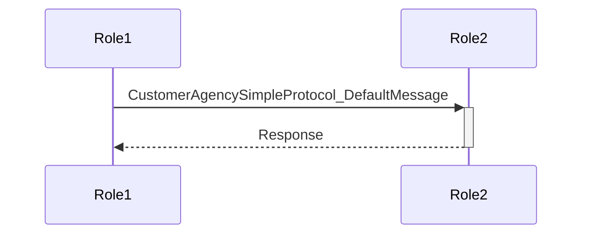

# Embedding Generated Diagrams in Doccomments

The `#[derive(GenerateDiagram)]` macro in Besedarium automatically embeds Mermaid sequence diagrams directly into doccomments, ensuring your protocol documentation always includes up-to-date visual representations.

## How It Works

### 1. Basic Usage

```rust
use besedarium::protocol::foundation::GlobalProtocol;
use besedarium_derive::GenerateDiagram;

/// My Protocol
/// 
/// This demonstrates basic protocol with automatic diagram embedding.
#[derive(Debug, GenerateDiagram)]
pub struct MyProtocol;

impl GlobalProtocol for MyProtocol {}
```

### 2. What Gets Generated

When you apply `#[derive(GenerateDiagram)]`, the macro automatically:

1. **Generates ProtocolFlow trait implementation** - Analyzes protocol structure
2. **Embeds diagrams in documentation** - Adds Mermaid diagrams to doc comments
3. **Provides runtime access** - Creates `generate_diagram()` method

### 3. Embedded Documentation Structure

The generated documentation includes:

```rust
/// # MyProtocol Protocol
///
/// This protocol provides structured communication between roles with automatic
/// type-safe message passing and state management.
///
/// ## Protocol Flow Diagram
///
/// The following diagram shows the complete communication flow:
///
/// ```mermaid
/// sequenceDiagram
///     participant Role1 as Role1
///     participant Role2 as Role2
///     Role1->>+Role2: MyProtocol_DefaultMessage
///     Role2-->>-Role1: Response
/// ```
///
/// ## Usage
///
/// Use `MyProtocol::generate_diagram()` to get the diagram at runtime.
```

## Implementation Details

### Compile-Time Generation

The diagram content is generated during macro expansion, ensuring:
- **Zero runtime cost** - Diagrams are pre-computed
- **Always synchronized** - Changes to protocol automatically update diagrams
- **Type safety** - Compilation fails if protocol structure is invalid

### Current Diagram Format

The current implementation generates basic sequence diagrams showing:
- Protocol participants as roles
- Basic message flow patterns
- Protocol-specific naming

### Example Output



## Viewing Embedded Diagrams

### In Documentation

1. Generate documentation:
   ```bash
   cargo doc --features derive --open
   ```

2. Navigate to your protocol structs in the generated docs

3. The embedded diagrams will be visible in the documentation with proper Mermaid rendering

### At Runtime

```rust
// Get the diagram as a string
let diagram = MyProtocol::generate_diagram();
println!("{}", diagram);

// Use in documentation tools, web interfaces, etc.
```

## Advanced Usage

### Custom Documentation

You can combine the automatic diagram generation with your own documentation:

```rust
/// Custom Protocol with Retry Logic
///
/// This protocol implements a robust request-response pattern with automatic
/// retry capabilities and timeout handling.
///
/// ## Features
/// - Automatic retry on failure
/// - Configurable timeout values
/// - Type-safe message passing
/// 
/// ## Implementation Notes
/// The protocol uses session types to ensure communication safety at compile time.
#[derive(Debug, GenerateDiagram)]
pub struct RetryProtocol;
```

The `#[derive(GenerateDiagram)]` will append its generated documentation to your existing docs.

### Integration with Other Derives

```rust
#[derive(Debug, Clone, PartialEq, GenerateDiagram)]
pub struct MyProtocol;
```

The diagram generation works seamlessly with other derive macros.

## Future Enhancements

The current implementation provides a foundation for more advanced features:

1. **Protocol Structure Analysis** - Extract actual protocol flow from type definitions
2. **Custom Diagram Types** - Support for state diagrams, flowcharts beyond sequences  
3. **Interactive Diagrams** - Click-to-navigate protocol states
4. **Validation Visualization** - Show protocol duality and projection results

## Benefits

### For Developers
- **Automatic Documentation** - Visual representations without manual maintenance
- **Consistency** - Diagrams always match implementation
- **Productivity** - Instant visual understanding of protocol structure

### For Teams
- **Living Documentation** - Diagrams update automatically with code changes
- **Communication** - Visual protocols improve team understanding
- **Onboarding** - New team members can quickly grasp protocol designs

### For Maintenance
- **Synchronization** - Impossible for docs to get out of sync with code
- **Refactoring** - Protocol changes automatically update all diagrams
- **Review** - Visual diffs make protocol changes easier to review

## Example: Complete Protocol with Embedded Diagrams

See `examples/verify_protocol_examples.rs` for working examples of:
- Customer-Agency Simple Protocol
- Customer-Agency Retry Protocol  
- Web Service with Proxy Protocol

Each demonstrates different aspects of the embedded diagram functionality.

## Troubleshooting

### Compilation Issues

If you encounter compilation errors:

1. Ensure the `derive` feature is enabled:
   ```toml
   besedarium = { version = "0.0.0", features = ["derive"] }
   ```

2. Import the derive macro:
   ```rust
   use besedarium_derive::GenerateDiagram;
   ```

3. Verify your protocol implements `GlobalProtocol`:
   ```rust
   impl GlobalProtocol for MyProtocol {}
   ```

### Documentation Not Showing

If embedded diagrams don't appear:

1. Build docs with derive feature:
   ```bash
   cargo doc --features derive
   ```

2. Check that your browser supports Mermaid rendering

3. Verify the generated HTML contains the embedded diagrams

## Conclusion

The `#[derive(GenerateDiagram)]` macro provides a seamless way to embed auto-generated protocol diagrams directly in your documentation. This ensures your protocol documentation is always visual, accurate, and up-to-date with zero manual maintenance overhead.
