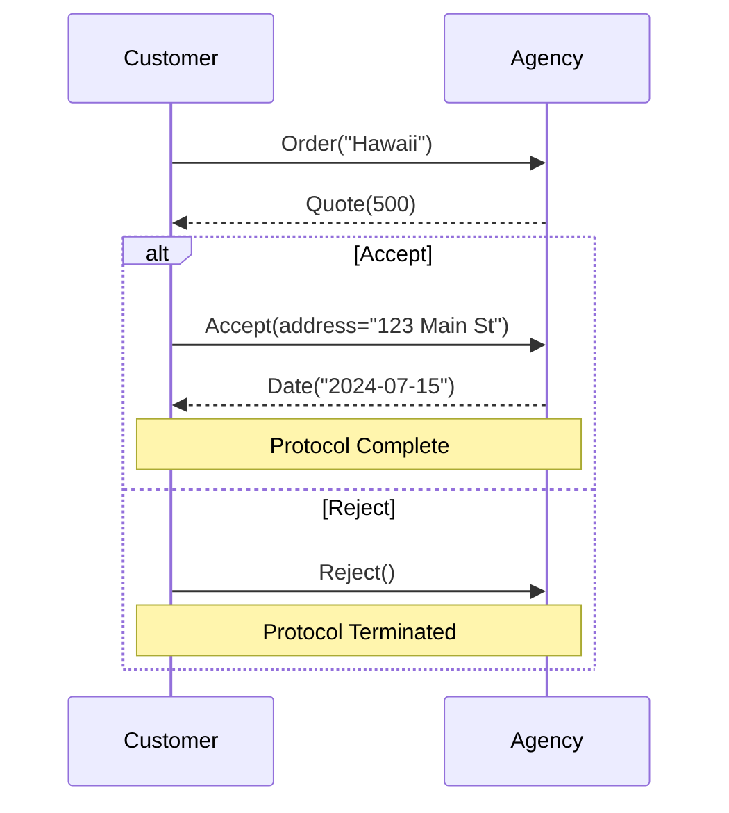
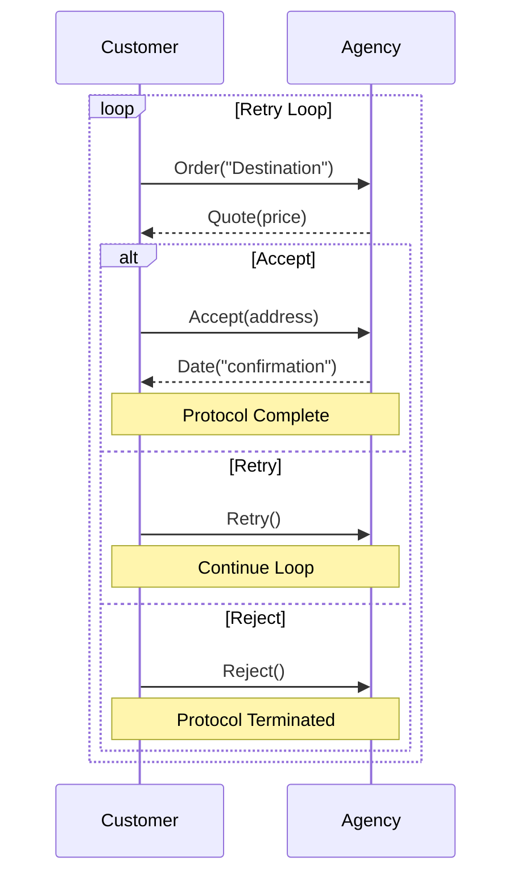

# Protocol Examples: Modern Rust Implementations

## Introduction

This document provides up-to-date Rust implementations for protocol examples using the current
Besedarium library API. These examples demonstrate practical patterns for implementing multi-party
session types with choices, messaging, and protocol coordination.

All examples use the current API structure with:

- Global protocol types: `TChanSend`, `TChanRecv`, `TChanChoice`, `TChanOffer`, etc.
- Foundation types: `Role`, `Message`, `GlobalProtocol` traits
- Channel/Label system: `ChanId`, `MsgLbl` with `DefaultChan`, `RequestLbl`, `ResponseLbl`
- Action I/O markers: `InputAction`, `OutputAction`, `BiDirectionalAction`

---

## 1. Customer-Agency Simple Protocol

### Protocol Description

A basic request-response protocol with choice:

1. Customer sends an order to the agency
2. Agency replies with a quote
3. Customer chooses to accept or reject:
   - **Accept**: Customer sends address, agency sends confirmation date
   - **Reject**: Protocol terminates immediately

### Protocol Diagram



### Rust Implementation

```rust
use besedarium::protocol::foundation::{
    Role, Message, GlobalProtocol,
    BiDirectionalAction, DefaultChan, RequestLbl, ResponseLbl
};
use besedarium::protocol::global::{TChanSend, TChanRecv, TChanChoice, TChanEnd};

// ============================================================================
// Roles
// ============================================================================

/// Customer role in the travel booking protocol
#[derive(Debug, Clone, PartialEq, Eq, Hash)]
pub struct Customer;
impl Role for Customer {}

/// Travel agency role in the booking protocol
#[derive(Debug, Clone, PartialEq, Eq, Hash)]
pub struct Agency;
impl Role for Agency {}

// ============================================================================
// Messages
// ============================================================================

/// Order message with destination
#[derive(Debug, Clone, PartialEq, Eq)]
pub struct Order {
    pub destination: String,
}
impl Message for Order {}

/// Quote message with price
#[derive(Debug, Clone, PartialEq, Eq)]
pub struct Quote {
    pub price: u32,
}
impl Message for Quote {}

/// Accept message with customer address
#[derive(Debug, Clone, PartialEq, Eq)]
pub struct Accept {
    pub address: String,
}
impl Message for Accept {}

/// Reject message (empty payload)
#[derive(Debug, Clone, PartialEq, Eq)]
pub struct Reject;
impl Message for Reject {}

/// Confirmation date message
#[derive(Debug, Clone, PartialEq, Eq)]
pub struct ConfirmationDate {
    pub date: String,
}
impl Message for ConfirmationDate {}

// ============================================================================
// Protocol Definition
// ============================================================================

/// Customer-Agency Simple Protocol
///
/// Flow:
/// 1. Customer → Agency: Order
/// 2. Agency → Customer: Quote  
/// 3. Customer's choice:
///    - Accept → Customer → Agency: Accept → Agency → Customer: Date → End
///    - Reject → End
pub type CustomerAgencySimpleProtocol = TChanSend<
    Customer,
    Agency,
    DefaultChan,
    RequestLbl,
    Order,
    TChanRecv<
        Agency,
        Customer,
        DefaultChan,
        ResponseLbl,
        Quote,
        TChanChoice<
            Customer,
            DefaultChan,
            RequestLbl,
            // Accept branch: Customer sends address, Agency confirms with date
            TChanSend<
                Customer,
                Agency,
                DefaultChan,
                RequestLbl,
                Accept,
                TChanRecv<
                    Agency,
                    Customer,
                    DefaultChan,
                    ResponseLbl,
                    ConfirmationDate,
                    TChanEnd<DefaultChan, ResponseLbl, BiDirectionalAction>,
                    BiDirectionalAction
                >,
                BiDirectionalAction
            >,
            // Reject branch: Protocol terminates immediately
            TChanEnd<DefaultChan, RequestLbl, BiDirectionalAction>,
            BiDirectionalAction
        >,
        BiDirectionalAction
    >,
    BiDirectionalAction
>;

/// Wrapper struct to implement GlobalProtocol trait
#[derive(Debug, Clone, PartialEq, Eq)]
pub struct CustomerAgencySimple(pub CustomerAgencySimpleProtocol);

impl GlobalProtocol for CustomerAgencySimple {}
```

---

## 2. Customer-Agency Retry Protocol

### Protocol Description

An extended protocol with retry capability:

1. Customer sends an order to the agency
2. Agency replies with a quote  
3. Customer chooses between three options:
   - **Accept**: Customer sends address, agency sends confirmation
   - **Retry**: Loop back to step 1 with a new order
   - **Reject**: Protocol terminates

### Protocol Diagram



### Rust Implementation

```rust
// Additional message for retry functionality
#[derive(Debug, Clone, PartialEq, Eq)]
pub struct Retry;
impl Message for Retry {}

/// Customer-Agency Retry Protocol with recursive retry capability
///
/// Note: This example demonstrates the protocol structure. Full recursion
/// would require TChanRec types when available in the future.
/// 
/// For now, we model the protocol as if it can loop through choice branches.
pub type CustomerAgencyRetryProtocol = TChanSend<
    Customer,
    Agency,
    DefaultChan,
    RequestLbl,
    Order,
    TChanRecv<
        Agency,
        Customer,
        DefaultChan,
        ResponseLbl,
        Quote,
        TChanChoice<
            Customer,
            DefaultChan,
            RequestLbl,
            // Accept branch: Complete the booking
            TChanSend<
                Customer,
                Agency,
                DefaultChan,
                RequestLbl,
                Accept,
                TChanRecv<
                    Agency,
                    Customer,
                    DefaultChan,
                    ResponseLbl,
                    ConfirmationDate,
                    TChanEnd<DefaultChan, ResponseLbl, BiDirectionalAction>,
                    BiDirectionalAction
                >,
                BiDirectionalAction
            >,
            // Choice between retry and reject
            TChanChoice<
                Customer,
                DefaultChan,
                RequestLbl,
                // Retry branch: Signal retry (would loop back in full implementation)
                TChanSend<
                    Customer,
                    Agency,
                    DefaultChan,
                    RequestLbl,
                    Retry,
                    TChanEnd<DefaultChan, RequestLbl, BiDirectionalAction>,
                    BiDirectionalAction
                >,
                // Reject branch: Terminate protocol
                TChanEnd<DefaultChan, RequestLbl, BiDirectionalAction>,
                BiDirectionalAction
            >,
            BiDirectionalAction
        >,
        BiDirectionalAction
    >,
    BiDirectionalAction
>;

/// Wrapper struct for retry protocol
#[derive(Debug, Clone, PartialEq, Eq)]
pub struct CustomerAgencyRetry(pub CustomerAgencyRetryProtocol);

impl GlobalProtocol for CustomerAgencyRetry {}
```

---

## 3. Web Service with Proxy Protocol

### Protocol Description

A three-party protocol involving client, proxy, and web service:

1. Client sends a request to the proxy
2. Proxy chooses to either forward or audit the request:
   - **Forward**: Proxy forwards to web service, web service replies to client
   - **Audit**: Proxy audits with web service, gets details, resumes, then web service replies to client

### Protocol Diagram

```mermaid
sequenceDiagram
    participant C as Client
    participant P as Proxy  
    participant W as WebService
    
    C->>P: Request("data")
    
    alt Forward
        P->>W: Forward(request)
        W-->>C: Reply("result")
        Note over C,P,W: Protocol Complete
    else Audit
        P->>W: Audit(request)
        W-->>P: AuditDetails("log info")
        P->>W: Resume()
        W-->>C: Reply("result")
        Note over C,P,W: Protocol Complete
    end
```

### Rust Implementation

```rust
// ============================================================================
// Additional Roles
// ============================================================================

/// Client role in the web service protocol
#[derive(Debug, Clone, PartialEq, Eq, Hash)]
pub struct Client;
impl Role for Client {}

/// Proxy role that mediates between client and web service
#[derive(Debug, Clone, PartialEq, Eq, Hash)]
pub struct Proxy;
impl Role for Proxy {}

/// Web service role that processes requests
#[derive(Debug, Clone, PartialEq, Eq, Hash)]
pub struct WebService;
impl Role for WebService {}

// ============================================================================
// Additional Messages
// ============================================================================

/// Client request message
#[derive(Debug, Clone, PartialEq, Eq)]
pub struct Request {
    pub data: String,
}
impl Message for Request {}

/// Forward message from proxy to web service
#[derive(Debug, Clone, PartialEq, Eq)]
pub struct Forward {
    pub request: Request,
}
impl Message for Forward {}

/// Audit message from proxy to web service
#[derive(Debug, Clone, PartialEq, Eq)]
pub struct Audit {
    pub request: Request,
}
impl Message for Audit {}

/// Audit details from web service to proxy
#[derive(Debug, Clone, PartialEq, Eq)]
pub struct AuditDetails {
    pub log_info: String,
}
impl Message for AuditDetails {}

/// Resume message from proxy to web service
#[derive(Debug, Clone, PartialEq, Eq)]
pub struct Resume;
impl Message for Resume {}

/// Reply message from web service to client
#[derive(Debug, Clone, PartialEq, Eq)]
pub struct Reply {
    pub result: String,
}
impl Message for Reply {}

// ============================================================================
// Protocol Definition
// ============================================================================

/// Web Service with Proxy Protocol
///
/// Flow:
/// 1. Client → Proxy: Request
/// 2. Proxy's choice:
///    - Forward → Proxy → WebService: Forward → WebService → Client: Reply → End
///    - Audit → Proxy → WebService: Audit → WebService → Proxy: AuditDetails 
///             → Proxy → WebService: Resume → WebService → Client: Reply → End
pub type WebServiceProxyProtocol = TChanSend<
    Client,
    Proxy,
    DefaultChan,
    RequestLbl,
    Request,
    TChanChoice<
        Proxy,
        DefaultChan,
        RequestLbl,
        // Forward branch: Simple forwarding
        TChanSend<
            Proxy,
            WebService,
            DefaultChan,
            RequestLbl,
            Forward,
            TChanSend<
                WebService,
                Client,
                DefaultChan,
                ResponseLbl,
                Reply,
                TChanEnd<DefaultChan, ResponseLbl, BiDirectionalAction>,
                BiDirectionalAction
            >,
            BiDirectionalAction
        >,
        // Audit branch: Complex audit flow
        TChanSend<
            Proxy,
            WebService,
            DefaultChan,
            RequestLbl,
            Audit,
            TChanRecv<
                WebService,
                Proxy,
                DefaultChan,
                ResponseLbl,
                AuditDetails,
                TChanSend<
                    Proxy,
                    WebService,
                    DefaultChan,
                    RequestLbl,
                    Resume,
                    TChanSend<
                        WebService,
                        Client,
                        DefaultChan,
                        ResponseLbl,
                        Reply,
                        TChanEnd<DefaultChan, ResponseLbl, BiDirectionalAction>,
                        BiDirectionalAction
                    >,
                    BiDirectionalAction
                >,
                BiDirectionalAction
            >,
            BiDirectionalAction
        >,
        BiDirectionalAction
    >,
    BiDirectionalAction
>;

/// Wrapper struct for web service proxy protocol
#[derive(Debug, Clone, PartialEq, Eq)]
pub struct WebServiceProxy(pub WebServiceProxyProtocol);

impl GlobalProtocol for WebServiceProxy {}

// ============================================================================
// Utility Functions
// ============================================================================

/// Export Customer-Agency Simple protocol diagram
pub fn export_customer_agency_simple_diagram() -> String {
    r#"sequenceDiagram
    participant C as Customer
    participant A as Agency
    
    C->>A: Order("Hawaii")
    A-->>C: Quote(500)
    
    alt Accept
        C->>A: Accept(address="123 Main St")
        A-->>C: Date("2024-07-15")
        Note over C,A: Protocol Complete
    else Reject
        C->>A: Reject()
        Note over C,A: Protocol Terminated
    end"#.to_string()
}

/// Export Customer-Agency Retry protocol diagram
pub fn export_customer_agency_retry_diagram() -> String {
    r#"sequenceDiagram
    participant C as Customer
    participant A as Agency
    
    loop Retry Loop
        C->>A: Order("Destination")
        A-->>C: Quote(price)
        
        alt Accept
            C->>A: Accept(address)
            A-->>C: Date("confirmation")
            Note over C,A: Protocol Complete
        else Retry
            C->>A: Retry()
            Note over C,A: Continue Loop
        else Reject
            C->>A: Reject()
            Note over C,A: Protocol Terminated
        end
    end"#.to_string()
}

/// Export Web Service Proxy protocol diagram
pub fn export_web_service_proxy_diagram() -> String {
    r#"sequenceDiagram
    participant C as Client
    participant P as Proxy  
    participant W as WebService
    
    C->>P: Request("data")
    
    alt Forward
        P->>W: Forward(request)
        W-->>C: Reply("result")
        Note over C,P,W: Protocol Complete
    else Audit
        P->>W: Audit(request)
        W-->>P: AuditDetails("log info")
        P->>W: Resume()
        W-->>C: Reply("result")
        Note over C,P,W: Protocol Complete
    end"#.to_string()
}
```

---

## 4. Key Patterns and Insights

### Protocol Construction Patterns

1. **Role Definition**: Each participant is a unit struct implementing the `Role` trait
2. **Message Definition**: Protocol payloads are structs implementing the `Message` trait  
3. **Protocol Wrapping**: Global protocols must be wrapped in structs implementing `GlobalProtocol`
4. **Channel Parameters**: All protocol types use 7 parameters including channel, label, and action I/O markers

### Choice vs. Offer

- **TChanChoice**: Represents a role making a choice between protocol branches
- **TChanOffer**: Represents a role offering/handling choices made by others
- Choices project to local `EpChanChoice` for the chooser and `EpChanOffer` for others

### Type Aliases

The library provides convenient type aliases for common patterns:

- `SimpleChannelSend<S, R, Msg, P>` for basic sending
- `SimpleChannelRecv<R, S, Msg, P>` for basic receiving  
- `SimpleChannelChoice<R, Left, Right>` for basic choices

### Future Extensions

- **Recursion**: Full recursion support would use `TChanRec` types when available
- **N-ary Choice**: Multiple branches can be modeled with nested binary choices
- **Parallel Composition**: `TChanPar` enables concurrent protocol branches
- **Local Projection**: Automatic projection from global to local protocols

---

## 5. Complete Example Usage

```rust
fn main() {
    println!("Protocol Examples - Besedarium Library");
    println!("=====================================");
    println!();
    
    // Display available protocols
    println!("Protocols implemented:");
    println!("1. Customer-Agency Simple: Basic request-response with choice");
    println!("2. Customer-Agency Retry: Extended protocol with retry capability");  
    println!("3. Web Service Proxy: Three-party protocol with audit option");
    println!();
    
    // Export protocol diagrams
    println!("Mermaid diagrams:");
    println!();
    println!("Customer-Agency Simple:");
    println!("{}", export_customer_agency_simple_diagram());
    println!();
    println!("Customer-Agency Retry:");
    println!("{}", export_customer_agency_retry_diagram());
    println!();
    println!("Web Service Proxy:");
    println!("{}", export_web_service_proxy_diagram());
}

#[cfg(test)]
mod tests {
    use super::*;

    #[test]
    fn test_protocol_types_compile() {
        // Test that our protocol types compile correctly
        let _simple: CustomerAgencySimpleProtocol;
        let _retry: CustomerAgencyRetryProtocol;
        let _proxy: WebServiceProxyProtocol;
    }

    #[test]
    fn test_protocol_wrappers() {
        // Test that our wrapper types implement GlobalProtocol
        fn assert_global_protocol<T: GlobalProtocol>() {}
        assert_global_protocol::<CustomerAgencySimple>();
        assert_global_protocol::<CustomerAgencyRetry>();
        assert_global_protocol::<WebServiceProxy>();
    }

    #[test]
    fn test_role_traits() {
        // Test that our role types implement the Role trait
        fn assert_role<T: Role>() {}
        assert_role::<Customer>();
        assert_role::<Agency>();
        assert_role::<Client>();
        assert_role::<Proxy>();
        assert_role::<WebService>();
    }

    #[test]
    fn test_message_traits() {
        // Test that our message types implement the Message trait
        fn assert_message<T: Message>() {}
        assert_message::<Order>();
        assert_message::<Quote>();
        assert_message::<Accept>();
        assert_message::<Reject>();
        assert_message::<ConfirmationDate>();
        assert_message::<Retry>();
        assert_message::<Request>();
        assert_message::<Forward>();
        assert_message::<Audit>();
        assert_message::<AuditDetails>();
        assert_message::<Resume>();
        assert_message::<Reply>();
    }

    #[test]
    fn test_diagram_export() {
        // Test that diagram export functions work
        let simple_diagram = export_customer_agency_simple_diagram();
        let retry_diagram = export_customer_agency_retry_diagram();
        let proxy_diagram = export_web_service_proxy_diagram();
        
        assert!(simple_diagram.contains("sequenceDiagram"));
        assert!(simple_diagram.contains("Customer"));
        assert!(simple_diagram.contains("Agency"));
        
        assert!(retry_diagram.contains("sequenceDiagram"));
        assert!(retry_diagram.contains("Retry Loop"));
        
        assert!(proxy_diagram.contains("sequenceDiagram"));
        assert!(proxy_diagram.contains("Client"));
        assert!(proxy_diagram.contains("Proxy"));
        assert!(proxy_diagram.contains("WebService"));
    }
}
