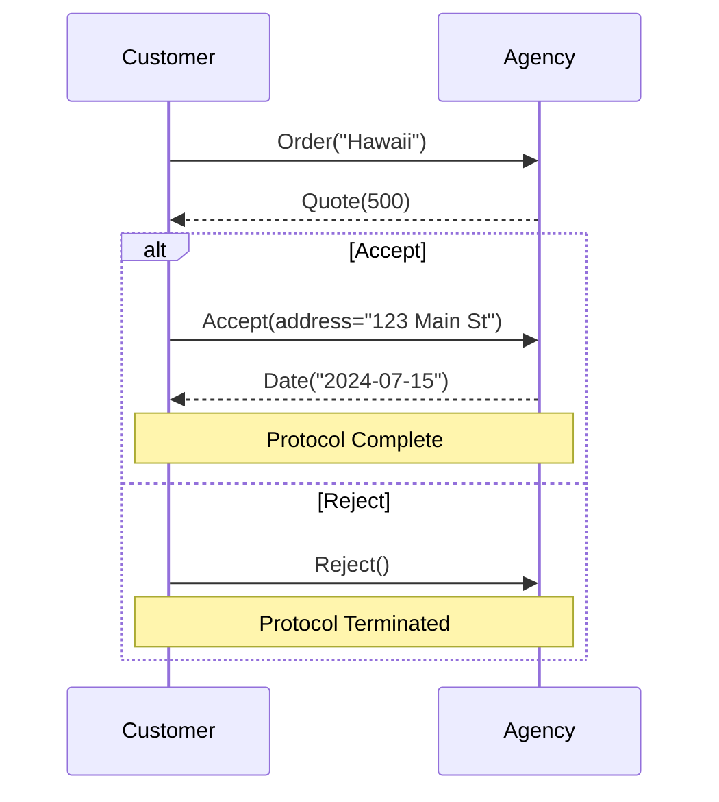
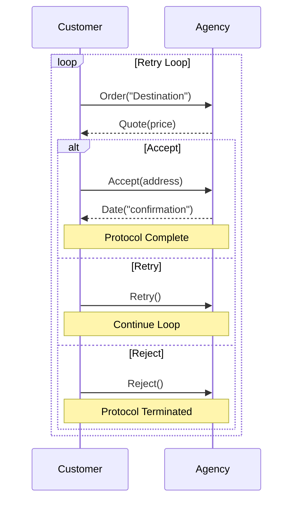

# Protocol Examples: Modern Rust Implementations

## Introduction

This document provides up-to-date Rust implementations for protocol examples using the current
Besedarium library API. These examples demonstrate practical patterns for implementing multi-party
session types with choices, messaging, and protocol coordination.

All examples use the current API structure with:

- Global protocol types: `TChanSend`, `TChanRecv`, `TChanChoice`, `TChanOffer`, etc.
- Foundation types: `Role`, `Message`, `GlobalProtocol` traits
- Channel/Label system: `ChanId`, `MsgLbl` with `DefaultChan`, `RequestLbl`, `ResponseLbl`
- Action I/O markers: `InputAction`, `OutputAction`, `BiDirectionalAction`

---

## 1. Customer-Agency Simple Protocol

### Protocol Description

A basic request-response protocol with choice:

1. Customer sends an order to the agency
2. Agency replies with a quote
3. Customer chooses to accept or reject:
   - **Accept**: Customer sends address, agency sends confirmation date
   - **Reject**: Protocol terminates immediately

### Protocol Diagram



### Rust Implementation

```rust
use besedarium::protocol::foundation::{
    Role, Message, GlobalProtocol,
    BiDirectionalAction, DefaultChan, RequestLbl, ResponseLbl
};
use besedarium::protocol::global::{TChanSend, TChanRecv, TChanChoice, TChanEnd};

// ============================================================================
// Roles
// ============================================================================

/// Customer role in the travel booking protocol
#[derive(Debug, Clone, PartialEq, Eq, Hash)]
pub struct Customer;
impl Role for Customer {}

/// Travel agency role in the booking protocol
#[derive(Debug, Clone, PartialEq, Eq, Hash)]
pub struct Agency;
impl Role for Agency {}

// ============================================================================
// Messages
// ============================================================================

/// Order message with destination
#[derive(Debug, Clone, PartialEq, Eq)]
pub struct Order {
    pub destination: String,
}
impl Message for Order {}

/// Quote message with price
#[derive(Debug, Clone, PartialEq, Eq)]
pub struct Quote {
    pub price: u32,
}
impl Message for Quote {}

/// Accept message with customer address
#[derive(Debug, Clone, PartialEq, Eq)]
pub struct Accept {
    pub address: String,
}
impl Message for Accept {}

/// Reject message (empty payload)
#[derive(Debug, Clone, PartialEq, Eq)]
pub struct Reject;
impl Message for Reject {}

/// Confirmation date message
#[derive(Debug, Clone, PartialEq, Eq)]
pub struct ConfirmationDate {
    pub date: String,
}
impl Message for ConfirmationDate {}

// ============================================================================
// Protocol Definition
// ============================================================================

/// Customer-Agency Simple Protocol
///
/// Flow:
/// 1. Customer → Agency: Order
/// 2. Agency → Customer: Quote  
/// 3. Customer's choice:
///    - Accept → Customer → Agency: Accept → Agency → Customer: Date → End
///    - Reject → End
pub type CustomerAgencySimpleProtocol = TChanSend<
    Customer,
    Agency,
    DefaultChan,
    RequestLbl,
    Order,
    TChanRecv<
        Agency,
        Customer,
        DefaultChan,
        ResponseLbl,
        Quote,
        TChanChoice<
            Customer,
            DefaultChan,
            RequestLbl,
            // Accept branch: Customer sends address, Agency confirms with date
            TChanSend<
                Customer,
                Agency,
                DefaultChan,
                RequestLbl,
                Accept,
                TChanRecv<
                    Agency,
                    Customer,
                    DefaultChan,
                    ResponseLbl,
                    ConfirmationDate,
                    TChanEnd<DefaultChan, ResponseLbl, BiDirectionalAction>,
                    BiDirectionalAction
                >,
                BiDirectionalAction
            >,
            // Reject branch: Protocol terminates immediately
            TChanEnd<DefaultChan, RequestLbl, BiDirectionalAction>,
            BiDirectionalAction
        >,
        BiDirectionalAction
    >,
    BiDirectionalAction
>;

/// Wrapper struct to implement GlobalProtocol trait
#[derive(Debug, Clone, PartialEq, Eq)]
pub struct CustomerAgencySimple(pub CustomerAgencySimpleProtocol);

impl GlobalProtocol for CustomerAgencySimple {}
```

---

## 2. Customer-Agency Retry Protocol

### Protocol Description

An extended protocol with retry capability:

1. Customer sends an order to the agency
2. Agency replies with a quote  
3. Customer chooses between three options:
   - **Accept**: Customer sends address, agency sends confirmation
   - **Retry**: Loop back to step 1 with a new order
   - **Reject**: Protocol terminates

### Protocol Diagram



### Rust Implementation

```rust
// Additional message for retry functionality
#[derive(Debug, Clone, PartialEq, Eq)]
pub struct Retry;
impl Message for Retry {}

/// Customer-Agency Retry Protocol with recursive retry capability
///
/// Note: This example demonstrates the protocol structure. Full recursion
/// would require TChanRec types when available in the future.
/// 
/// For now, we model the protocol as if it can loop through choice branches.
pub type CustomerAgencyRetryProtocol = TChanSend<
    Customer,
    Agency,
    DefaultChan,
    RequestLbl,
    Order,
    TChanRecv<
        Agency,
        Customer,
        DefaultChan,
        ResponseLbl,
        Quote,
        TChanChoice<
            Customer,
            DefaultChan,
            RequestLbl,
            // Accept branch: Complete the booking
            TChanSend<
                Customer,
                Agency,
                DefaultChan,
                RequestLbl,
                Accept,
                TChanRecv<
                    Agency,
                    Customer,
                    DefaultChan,
                    ResponseLbl,
                    ConfirmationDate,
                    TChanEnd<DefaultChan, ResponseLbl, BiDirectionalAction>,
                    BiDirectionalAction
                >,
                BiDirectionalAction
            >,
            // Choice between retry and reject
            TChanChoice<
                Customer,
                DefaultChan,
                RequestLbl,
                // Retry branch: Signal retry (would loop back in full implementation)
                TChanSend<
                    Customer,
                    Agency,
                    DefaultChan,
                    RequestLbl,
                    Retry,
                    TChanEnd<DefaultChan, RequestLbl, BiDirectionalAction>,
                    BiDirectionalAction
                >,
                // Reject branch: Terminate protocol
                TChanEnd<DefaultChan, RequestLbl, BiDirectionalAction>,
                BiDirectionalAction
            >,
            BiDirectionalAction
        >,
        BiDirectionalAction
    >,
    BiDirectionalAction
>;

/// Wrapper struct for retry protocol
#[derive(Debug, Clone, PartialEq, Eq)]
pub struct CustomerAgencyRetry(pub CustomerAgencyRetryProtocol);

impl GlobalProtocol for CustomerAgencyRetry {}
```

---

## 3. Web Service with Proxy Protocol

### Protocol Description

A three-party protocol involving client, proxy, and web service:

1. Client sends a request to the proxy
2. Proxy chooses to either forward or audit the request:
   - **Forward**: Proxy forwards to web service, web service replies to client
   - **Audit**: Proxy audits with web service, gets details, resumes, then web service replies to client

### Protocol Diagram

```mermaid
sequenceDiagram
    participant C as Client
    participant P as Proxy  
    participant W as WebService
    
    C->>P: Request("data")
    
    alt Forward
        P->>W: Forward(request)
        W-->>C: Reply("result")
        Note over C,P,W: Protocol Complete
    else Audit
        P->>W: Audit(request)
        W-->>P: AuditDetails("log info")
        P->>W: Resume()
        W-->>C: Reply("result")
        Note over C,P,W: Protocol Complete
    end
```

### Rust Implementation

```rust
// ============================================================================
// Additional Roles
// ============================================================================

/// Client role in the web service protocol
#[derive(Debug, Clone, PartialEq, Eq, Hash)]
pub struct Client;
impl Role for Client {}

/// Proxy role that mediates between client and web service
#[derive(Debug, Clone, PartialEq, Eq, Hash)]
pub struct Proxy;
impl Role for Proxy {}

/// Web service role that processes requests
#[derive(Debug, Clone, PartialEq, Eq, Hash)]
pub struct WebService;
impl Role for WebService {}

// ============================================================================
// Additional Messages
// ============================================================================

/// Client request message
#[derive(Debug, Clone, PartialEq, Eq)]
pub struct Request {
    pub data: String,
}
impl Message for Request {}

/// Forward message from proxy to web service
#[derive(Debug, Clone, PartialEq, Eq)]
pub struct Forward {
    pub request: Request,
}
impl Message for Forward {}

/// Audit message from proxy to web service
#[derive(Debug, Clone, PartialEq, Eq)]
pub struct Audit {
    pub request: Request,
}
impl Message for Audit {}

/// Audit details from web service to proxy
#[derive(Debug, Clone, PartialEq, Eq)]
pub struct AuditDetails {
    pub log_info: String,
}
impl Message for AuditDetails {}

/// Resume message from proxy to web service
#[derive(Debug, Clone, PartialEq, Eq)]
pub struct Resume;
impl Message for Resume {}

/// Reply message from web service to client
#[derive(Debug, Clone, PartialEq, Eq)]
pub struct Reply {
    pub result: String,
}
impl Message for Reply {}

// ============================================================================
// Protocol Definition
// ============================================================================

/// Web Service with Proxy Protocol
///
/// Flow:
/// 1. Client → Proxy: Request
/// 2. Proxy's choice:
///    - Forward → Proxy → WebService: Forward → WebService → Client: Reply → End
///    - Audit → Proxy → WebService: Audit → WebService → Proxy: AuditDetails 
///             → Proxy → WebService: Resume → WebService → Client: Reply → End
pub type WebServiceProxyProtocol = TChanSend<
    Client,
    Proxy,
    DefaultChan,
    RequestLbl,
    Request,
    TChanChoice<
        Proxy,
        DefaultChan,
        RequestLbl,
        // Forward branch: Simple forwarding
        TChanSend<
            Proxy,
            WebService,
            DefaultChan,
            RequestLbl,
            Forward,
            TChanSend<
                WebService,
                Client,
                DefaultChan,
                ResponseLbl,
                Reply,
                TChanEnd<DefaultChan, ResponseLbl, BiDirectionalAction>,
                BiDirectionalAction
            >,
            BiDirectionalAction
        >,
        // Audit branch: Complex audit flow
        TChanSend<
            Proxy,
            WebService,
            DefaultChan,
            RequestLbl,
            Audit,
            TChanRecv<
                WebService,
                Proxy,
                DefaultChan,
                ResponseLbl,
                AuditDetails,
                TChanSend<
                    Proxy,
                    WebService,
                    DefaultChan,
                    RequestLbl,
                    Resume,
                    TChanSend<
                        WebService,
                        Client,
                        DefaultChan,
                        ResponseLbl,
                        Reply,
                        TChanEnd<DefaultChan, ResponseLbl, BiDirectionalAction>,
                        BiDirectionalAction
                    >,
                    BiDirectionalAction
                >,
                BiDirectionalAction
            >,
            BiDirectionalAction
        >,
        BiDirectionalAction
    >,
    BiDirectionalAction
>;

/// Wrapper struct for web service proxy protocol
#[derive(Debug, Clone, PartialEq, Eq)]
pub struct WebServiceProxy(pub WebServiceProxyProtocol);

impl GlobalProtocol for WebServiceProxy {}

// ============================================================================
// Utility Functions
// ============================================================================

/// Export Customer-Agency Simple protocol diagram
pub fn export_customer_agency_simple_diagram() -> String {
    r#"sequenceDiagram
    participant C as Customer
    participant A as Agency
    
    C->>A: Order("Hawaii")
    A-->>C: Quote(500)
    
    alt Accept
        C->>A: Accept(address="123 Main St")
        A-->>C: Date("2024-07-15")
        Note over C,A: Protocol Complete
    else Reject
        C->>A: Reject()
        Note over C,A: Protocol Terminated
    end"#.to_string()
}

/// Export Customer-Agency Retry protocol diagram
pub fn export_customer_agency_retry_diagram() -> String {
    r#"sequenceDiagram
    participant C as Customer
    participant A as Agency
    
    loop Retry Loop
        C->>A: Order("Destination")
        A-->>C: Quote(price)
        
        alt Accept
            C->>A: Accept(address)
            A-->>C: Date("confirmation")
            Note over C,A: Protocol Complete
        else Retry
            C->>A: Retry()
            Note over C,A: Continue Loop
        else Reject
            C->>A: Reject()
            Note over C,A: Protocol Terminated
        end
    end"#.to_string()
}

/// Export Web Service Proxy protocol diagram
pub fn export_web_service_proxy_diagram() -> String {
    r#"sequenceDiagram
    participant C as Client
    participant P as Proxy  
    participant W as WebService
    
    C->>P: Request("data")
    
    alt Forward
        P->>W: Forward(request)
        W-->>C: Reply("result")
        Note over C,P,W: Protocol Complete
    else Audit
        P->>W: Audit(request)
        W-->>P: AuditDetails("log info")
        P->>W: Resume()
        W-->>C: Reply("result")
        Note over C,P,W: Protocol Complete
    end"#.to_string()
}
```

---

## 4. Key Patterns and Insights

### Protocol Construction Patterns

1. **Role Definition**: Each participant is a unit struct implementing the `Role` trait
2. **Message Definition**: Protocol payloads are structs implementing the `Message` trait  
3. **Protocol Wrapping**: Global protocols must be wrapped in structs implementing `GlobalProtocol`
4. **Channel Parameters**: All protocol types use 7 parameters including channel, label, and action I/O markers

### Choice vs. Offer

- **TChanChoice**: Represents a role making a choice between protocol branches
- **TChanOffer**: Represents a role offering/handling choices made by others
- Choices project to local `EpChanChoice` for the chooser and `EpChanOffer` for others

### Type Aliases

The library provides convenient type aliases for common patterns:

- `SimpleChannelSend<S, R, Msg, P>` for basic sending
- `SimpleChannelRecv<R, S, Msg, P>` for basic receiving  
- `SimpleChannelChoice<R, Left, Right>` for basic choices

### Future Extensions

- **Recursion**: Full recursion support would use `TChanRec` types when available
- **N-ary Choice**: Multiple branches can be modeled with nested binary choices
- **Parallel Composition**: `TChanPar` enables concurrent protocol branches
- **Local Projection**: Automatic projection from global to local protocols

---

## 5. Complete Example Usage

```rust
Rec<"main_loop",
    Interact<Alice, Bob, Ping,
        Interact<Bob, Alice, Pong,
            Choice<Alice, (
                ("again", Break<"main_loop">),
                ("stop", End)
            )>
        >
    >
>
```

- Here, `Rec<"main_loop">` introduces a recursion point with a globally unique label.
- `Break<"main_loop">` refers unambiguously to that point, looping back.
- This is equivalent to `Mu(X) ... Var(X)` in classic session types.

### 5.2. Flat Namespace: Simplicity and Limitations

By enforcing a single global namespace for recursion labels (i.e., all labels must be unique within
a protocol), we:

- **Avoid Scoping Complexity:** No need for nested scopes, shadowing, or stack-based resolution.
Label lookup is always global.
- **Simplify Implementation:** Projection, type-checking, and code generation are
straightforward—just match labels globally.
- **Catch Errors Early:** Duplicate or ambiguous labels are caught at protocol definition time.

#### Limitations

- **No Mutual Recursion:** You cannot have two recursion points with the same label, so mutual
recursion (where two or more recursion points refer to each other) is not possible.
- **Flat Namespace:** All labels must be unique, which could be a minor inconvenience in very large
or generated protocols.
- **Expressiveness:** For most practical protocols, this is not a problem, but it does restrict the
theoretical expressiveness compared to full Mu/Var with scoping.

#### Example: What You Cannot Do

Suppose you want two mutually recursive blocks:

```ignore
Rec<"A",
    ... Break<"B"> ...
>
Rec<"B",
    ... Break<"A"> ...
>
```

With a flat namespace, you cannot have both "A" and "B" in scope at the same time, so this pattern
is not supported.

### 5.3. Higher-Level Protocol Languages

The flat label approach can serve as a substrate for higher-level protocol languages or libraries.
For example:

- A macro or code generator could manage unique label generation and simulate mutual recursion by
flattening or inlining protocol fragments.
- A more advanced protocol language could introduce scoped labels or variables, compiling down to
the flat-label substrate for execution or type-checking.

### 5.4. Design Guidance

- **Start Simple:** Use a flat, globally unique label namespace for recursion. This covers the vast
majority of real-world protocols and keeps the system easy to reason about.
- **Document Limitations:** Be explicit in documentation and error messages about the lack of
mutual recursion and the requirement for unique labels.
- **Plan for Extensibility:** If future needs require more expressiveness (e.g., mutual recursion),
consider layering a higher-level language or macro system on top of the flat-label core.

### 5.5. Summary Table

| Approach                | Pros                        | Cons                        | Use Case
              |
|-------------------------|-----------------------------|-----------------------------|-------------
--------------|
| Flat global labels      | Simple, easy to implement   | No mutual recursion         | Most
real-world protocols |
| Scoped Mu/Var           | Most expressive             | Complex, harder to use      |
Advanced/academic         |
| Macro/codegen           | User-friendly, flexible     | Tooling required            |
Large/generated protocols |

---

*This section was added to clarify the design trade-offs around recursion, labels, and scoping in
Besedarium. It is intended to guide both users and implementers in making informed, practical
choices.*

---

## 6. Mutual Recursion via Par and Rec: Options, Dangers, and Caveats

### 6.1. Modeling Mutual Recursion with Par and Rec

It is possible to encode certain forms of mutual recursion by combining `Par` (parallel
composition) and `Rec` (recursion), provided the restriction that Par branches must have disjoint
sets of roles is relaxed. In this approach:

- Each `Rec` block represents a protocol state or phase.
- `Par` allows these states to be "active" in parallel.
- Shared roles can coordinate transitions between these states by sending/receiving messages that
trigger a jump from one Rec block to another.

#### Example: Two-State Mutual Recursion

```ignore
Par(
  Rec<"A",
    ... Choice { toB: ...Break<"B">... } ...
  >,
  Rec<"B",
    ... Choice { toA: ...Break<"A">... } ...
  >
)
```

Here, both Rec blocks are live, and transitions between A and B are coordinated by explicit
protocol actions.

### 6.2. Dangers and Caveats

#### a. **Synchronization Complexity**

- When roles are shared between Par branches, transitions between states must be carefully
synchronized by explicit messages.
- If one role transitions but another does not, the protocol can deadlock or diverge.
- The projection algorithm and runtime must ensure that all roles agree on the current state.

#### b. **State Explosion and Reasoning**

- Multiple Rec blocks running in parallel can lead to a state explosion, making the protocol harder
to reason about, verify, and maintain.
- Deadlock-freedom and progress become much harder to check, as the number of possible
interleavings increases.

#### c. **Expressiveness vs. Safety**

- While this approach increases expressiveness (allowing more complex, interleaved, or stateful
protocols), it also increases the risk of subtle bugs, such as unsynchronized transitions,
livelocks, or unreachable states.
- The lack of disjointness means that the same role may have to "choose" between multiple possible
actions at the same time, which can be ambiguous or ill-defined.

#### d. **Tooling and Implementation Burden**

- Projection, type-checking, and code generation become significantly more complex.
- Runtime implementations must track and synchronize state across all roles, which may require
additional protocol messages or coordination logic.

### 6.3. Exploring the Options

#### Option 1: **Keep Disjointness Restriction**

- Simpler, safer, and easier to reason about.
- No mutual recursion, but protocols are easier to verify and implement.

#### Option 2: **Relax Disjointness for Advanced Users**

- Allows mutual recursion and more expressive protocols.
- Must be accompanied by strong warnings, advanced static analysis, and possibly runtime checks to
prevent deadlocks and divergence.
- Best suited for protocol designers who understand the risks and are willing to invest in careful
design and verification.

#### Option 3: **Higher-Level Abstractions**

- Provide macros, code generators, or higher-level protocol languages that can safely encode mutual
recursion patterns, compiling down to safe, well-formed Par/Rec combinations.
- This can hide complexity from most users while still allowing advanced expressiveness when needed.

### 6.4. Summary Table

| Option                        | Pros                        | Cons                        | Use
Case                  |
|-------------------------------|-----------------------------|-----------------------------|-------
--------------------|
| Disjoint Par (default)        | Simple, safe, verifiable    | No mutual recursion         | Most
protocols            |
| Par+Rec, shared roles         | Expressive, flexible        | Complex, risky, error-prone |
Advanced protocols        |
| Macro/codegen abstraction     | User-friendly, safe         | Tooling required            |
Large/generated protocols |

### 6.5. Guidance

- **Default to safety:** Keep the disjointness restriction unless there is a compelling need for
mutual recursion.
- **Document risks:** If relaxing the restriction, clearly document the dangers and require
explicit opt-in.
- **Invest in tooling:** If supporting advanced patterns, provide static analysis and runtime
checks to help users avoid common pitfalls.
- **Encourage explicit synchronization:** Always require that transitions between states are driven
by explicit protocol actions, not by local or implicit control flow.

---

*This section documents the options, dangers, and caveats of modeling mutual recursion via Par and
Rec, to guide protocol designers in making informed, safe choices.*

---

# Protocol Examples: Modern Rust Implementations

## Introduction

This document provides up-to-date Rust implementations for protocol examples using the current
Besedarium library API. These examples demonstrate practical patterns for implementing multi-party
session types with choices, messaging, and protocol coordination.

All examples use the current API structure with:

- Global protocol types: `TChanSend`, `TChanRecv`, `TChanChoice`, `TChanOffer`, etc.
- Foundation types: `Role`, `Message`, `GlobalProtocol` traits
- Channel/Label system: `ChanId`, `MsgLbl` with `DefaultChan`, `RequestLbl`, `ResponseLbl`
- Action I/O markers: `InputAction`, `OutputAction`, `BiDirectionalAction`

---

## Integration Tests: Real Working Examples

This section leverages the actual integration tests from Task 2.4, providing real working code examples that compile and run successfully with the current Besedarium API. These examples bridge the gap between theoretical concepts and practical implementation.

### 1. Simple Login Protocol (From Integration Tests)

**File:** `tests/client_server_integration.rs`

This is a real working example that demonstrates the fundamental patterns:

```rust
use besedarium::protocol::foundation::*;
use besedarium::protocol::global::*;

// Simple Login Protocol: Client → Server (login) → Client (ack) → End
type LoginProtocol = TChanSend<
    Alice,    // Sender: Client (Alice)
    Bob,      // Receiver: Server (Bob)
    AuthChan, // Channel: Auth channel
    LoginLbl, // Message label: Login
    LoginMsg, // Message: Login credentials
    TChanSend<
        // Continuation: Server responds
        Bob,                                             // Sender: Server (Bob)
        Alice,                                           // Receiver: Client (Alice)
        AuthChan,                                        // Channel: Auth channel
        AckLbl,                                          // Message label: Ack
        AckMsg,                                          // Message: Acknowledgment
        TChanEnd<AuthChan, AckLbl, BiDirectionalAction>, // End protocol
        BiDirectionalAction,
    >,
    BiDirectionalAction,
>;
```

**Message Types (From `tests/integration_common.rs`):**

```rust
// Login message with username and password
#[derive(Debug, Clone)]
pub struct LoginMsg(pub String, pub String);
impl Message for LoginMsg {}

// Acknowledgment message with success flag and optional token
#[derive(Debug, Clone)]
pub struct AckMsg(pub bool, pub Option<String>);
impl Message for AckMsg {}
```

**Key Features Demonstrated:**
- Sequential message exchange between two roles
- Proper channel and label usage
- Message type integration with foundation traits
- Protocol termination with `TChanEnd`

### 2. Multi-Party Protocol (Three Roles)

**Real Working Example from Integration Tests:**

```rust
// Three-party protocol: Client → Server → Database → Server → Client
type ThreePartyProtocol = TChanSend<
    Alice, // Client sends to Server
    Bob,
    AuthChan,
    LoginLbl,
    LoginMsg,
    TChanSend<
        // Server forwards to Database
        Bob,
        Charlie,
        DataChan,
        DataLbl,
        DataMsg,
        TChanRecv<
            // Database responds to Server
            Charlie,
            Bob,
            DataChan,
            ResultLbl,
            ResultMsg,
            TChanSend<
                // Server responds to Client
                Bob,
                Alice,
                AuthChan,
                AckLbl,
                AckMsg,
                TChanEnd<AuthChan, AckLbl, BiDirectionalAction>,
                BiDirectionalAction,
            >,
            BiDirectionalAction,
        >,
        BiDirectionalAction,
    >,
    BiDirectionalAction,
>;
```

**Key Features:**
- Three distinct roles: Client (Alice), Server (Bob), Database (Charlie)
- Message forwarding pattern
- Multiple channel usage (`AuthChan`, `DataChan`)
- Real working message types from integration tests

### 3. Complex Data Serialization

**Working Example with Complex Message Types:**

```rust
// Complex user profile data structure
#[derive(Debug, Clone, PartialEq)]
pub struct UserProfile {
    pub user_id: u64,
    pub username: String,
    pub email: Option<String>,
    pub preferences: Vec<(String, String)>,
    pub aliases: Vec<String>,
}

// Server command enum with multiple variants
#[derive(Debug, Clone, PartialEq)]
pub enum ServerCommand {
    StoreProfile(UserProfile),
    ProcessOrder(OrderDetails),
    GetStatus,
}

// Protocol using complex data types
type UserProfileExchangeProtocol = TChanSend<
    Alice,          // Sender
    Bob,            // Receiver
    DataChan,       // Channel
    UserProfileLbl, // Message Label
    UserProfileMsg, // Message Type
    TChanSend<
        Bob,      // Sender
        Alice,    // Receiver
        DataChan, // Channel
        AckLbl,   // Message Label
        AckMsg,   // Message Type
        TChanEnd<DataChan, AckLbl, BiDirectionalAction>,
        BiDirectionalAction,
    >,
    BiDirectionalAction,
>;
```

**Key Features:**
- Complex nested data structures
- Optional fields and collections
- Enum variants with associated data
- Full integration with Message trait system

### 4. Protocol Duality Verification

**Real Working Duality Example:**

```rust
// Client perspective protocol
type ClientProtocol = TChanSend</* ... */>;

// Server perspective protocol (dual)
type ServerProtocol = TChanRecv<
    Alice,    // Receiver: Server receives from Client
    Bob,      // Sender: (from server perspective)
    AuthChan, // Channel: Auth channel
    LoginLbl, // Message label: Login
    LoginMsg, // Message: Login credentials
    TChanRecv<
        // Continuation: Server sends response
        Bob,      // Receiver: (from server perspective)
        Alice,    // Sender: Server sends to Client
        AuthChan, // Channel: Auth channel
        AckLbl,   // Message label: Ack
        AckMsg,   // Message: Acknowledgment
        TChanEnd<AuthChan, AckLbl, BiDirectionalAction>, // End protocol
        BiDirectionalAction,
    >,
    BiDirectionalAction,
>;
```

**Verification Pattern:**

```rust
#[test]
fn test_protocol_duality() {
    // Verify both protocols are valid
    fn requires_global_protocol<T: GlobalProtocol>(_: std::marker::PhantomData<T>) {}
    requires_global_protocol(std::marker::PhantomData::<ClientProtocol>);
    requires_global_protocol(std::marker::PhantomData::<ServerProtocol>);
    
    // TODO: When IsDual implementations are complete, add duality verification
}
```

### 5. Protocol Projection Testing

**Real Working Projection Examples:**

```rust
#[test]
fn test_protocol_projection() {
    // Test that protocols can be projected to local endpoints
    type AliceEndpoint = <() as Project<LoginProtocol, Alice>>::Output;
    type BobEndpoint = <() as Project<LoginProtocol, Bob>>::Output;

    // Verify projections are valid local protocols
    fn requires_local_protocol<T: LocalProtocol>(_: std::marker::PhantomData<T>) {}
    requires_local_protocol(std::marker::PhantomData::<AliceEndpoint>);
    requires_local_protocol(std::marker::PhantomData::<BobEndpoint>);
}
```

## Running and Verifying Integration Examples

### Test Execution

To run the real working examples from integration tests:

```bash
# Run all integration tests
cargo test --test client_server_integration

# Run specific test categories
cargo test --test client_server_integration test_login_protocol
cargo test --test client_server_integration test_multi_party_protocol
cargo test --test client_server_integration test_complex_data_exchange

# Run with verbose output to see detailed results
cargo test --test client_server_integration -- --nocapture
```

### Verification Examples

You can also run the verification examples:

```bash
# Run the protocol verification examples
cargo run --example verify_protocol_examples

# Run all examples
cargo run --example verify_protocol_examples --features all-examples
```

### Development Workflow

1. **Study Integration Tests**: Examine `tests/client_server_integration.rs` for working patterns
2. **Use Common Infrastructure**: Leverage `tests/integration_common.rs` for role and message definitions
3. **Verify Compilation**: Ensure your protocols compile with `cargo check`
4. **Test Projections**: Verify protocol projections work for all roles
5. **Add Integration Tests**: Contribute new examples to the integration test suite
