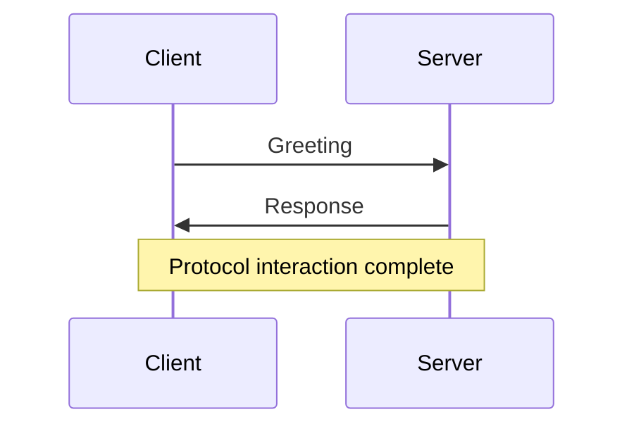
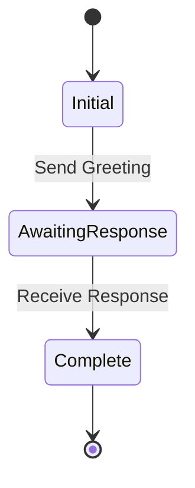
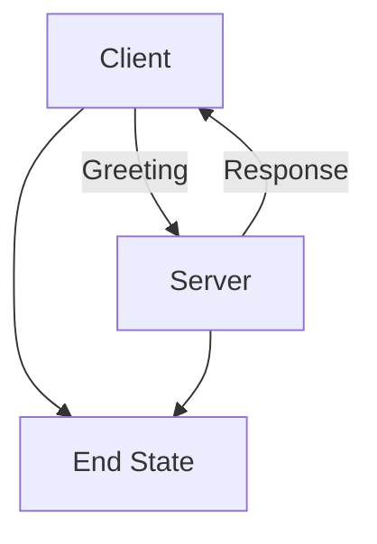
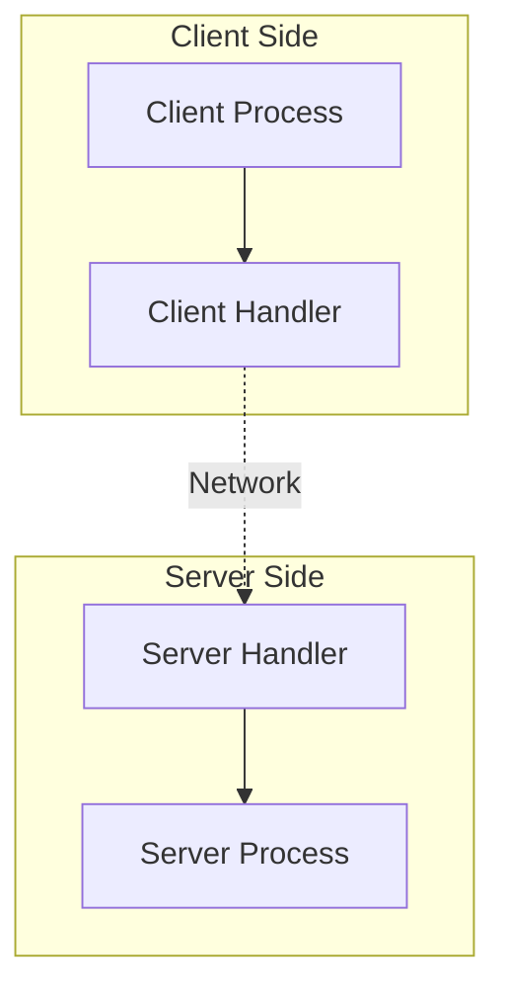
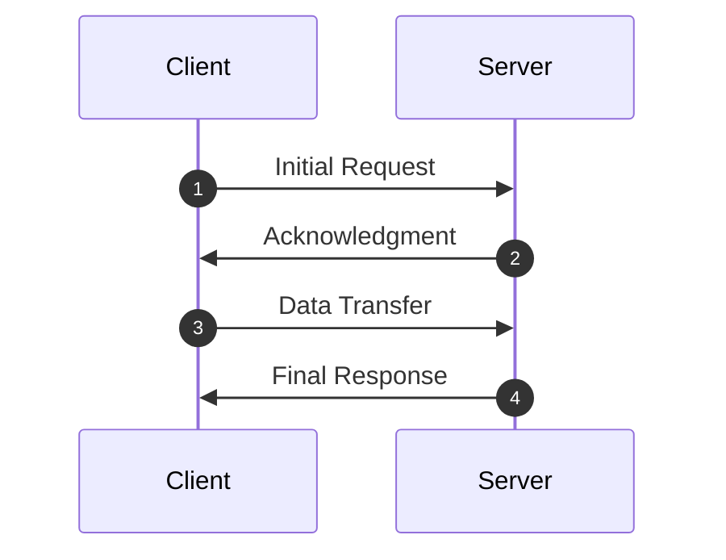
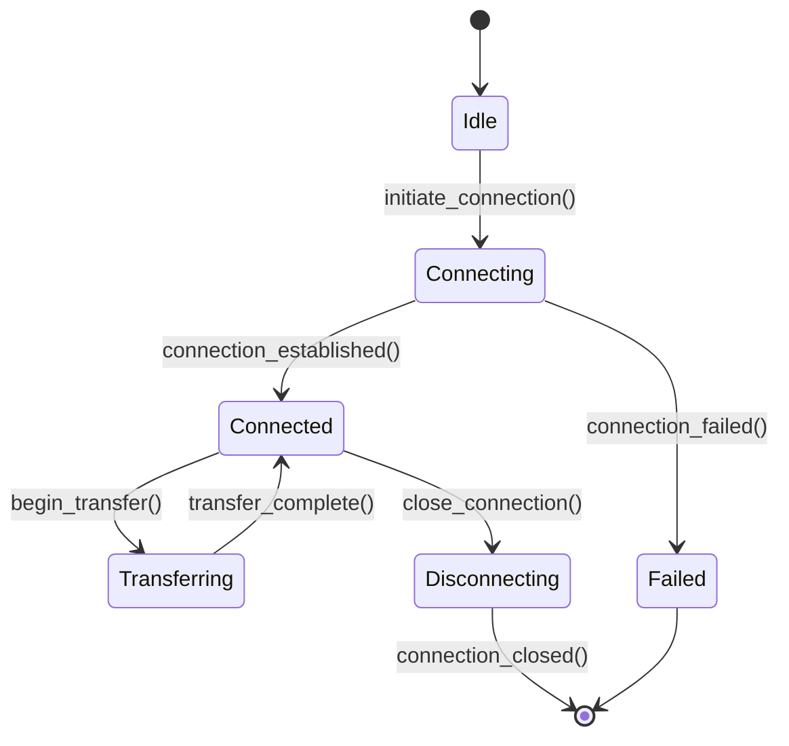
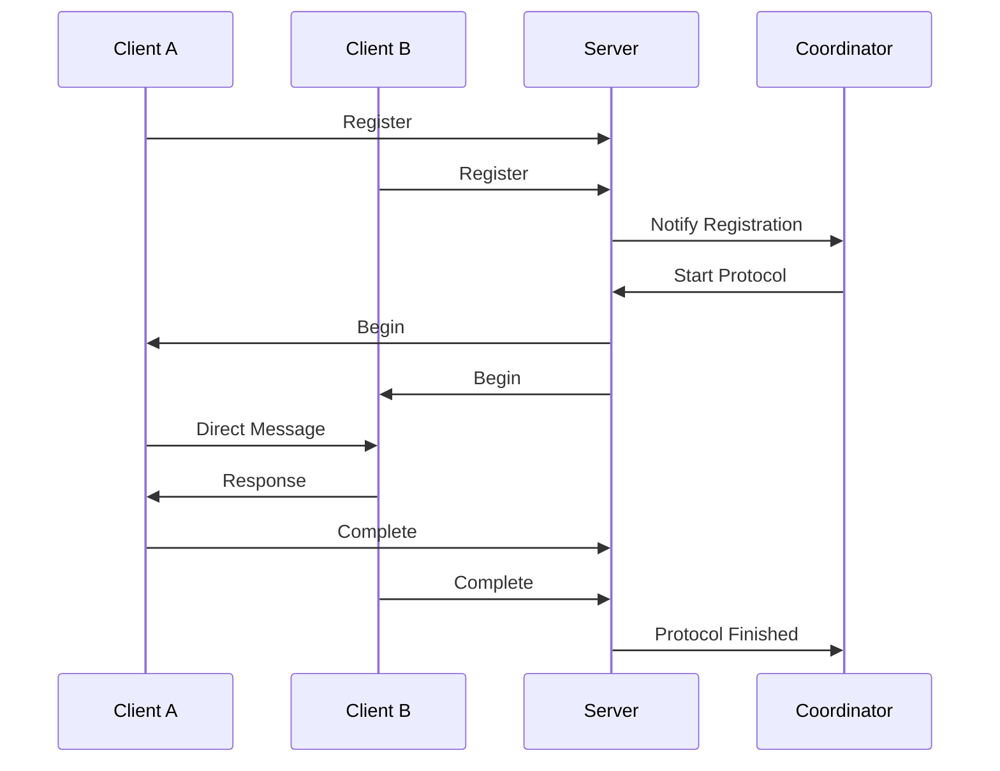
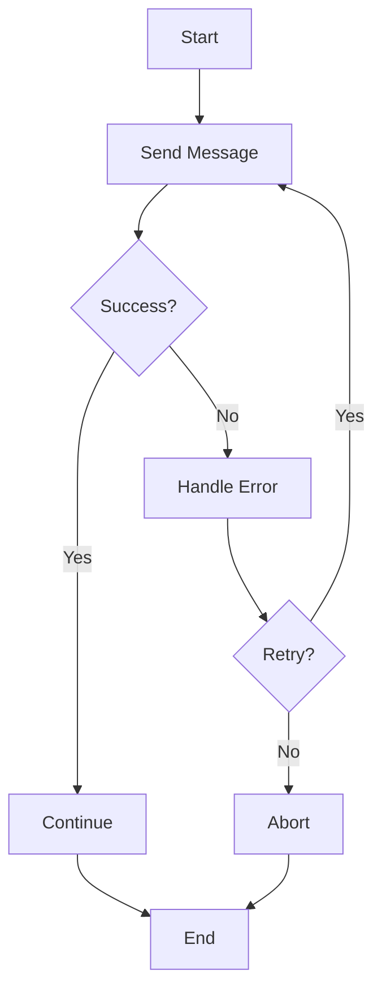

# Protocol Visualization Guide

This guide covers how to create and use protocol visualizations in the Besedarium 
framework, including integration with both rustdoc and mdBook workflows.

## Overview

The Besedarium framework provides built-in support for generating protocol 
visualizations using Mermaid diagrams. This enables clear visual representation 
of protocol structures, message flows, and communication patterns.

## Quick Start

### Basic Protocol Visualization

```rust
use besedarium::prelude::*;
use simple_mermaid::{mermaid, Mermaid};

// Define your protocol roles
#[derive(Debug, Clone, PartialEq)]
struct Client;
impl Role for Client {
    fn name(&self) -> &'static str { "Client" }
}

#[derive(Debug, Clone, PartialEq)]
struct Server;
impl Role for Server {
    fn name(&self) -> &'static str { "Server" }
}

// Define protocol messages
#[derive(Debug, Clone, PartialEq)]
struct Greeting(String);
impl Message for Greeting {
    fn name(&self) -> &'static str { "Greeting" }
}

// Create protocol type with 7 required parameters
type MyProtocol = (
    Client,                    // Sender role
    Server,                    // Receiver role  
    Greeting,                 // Message type
    DefaultChan,              // Channel ID type
    RequestLbl,               // Message label type
    OutputAction,             // Action type
    BiDirectionalAction       // Action IO marker
);

// Generate Mermaid diagram
fn export_protocol_diagram() -> String {
    let mut diagram = Mermaid::new();
    diagram.graph("TD");
    diagram.node("Client", "Client");
    diagram.node("Server", "Server");
    diagram.edge("Client", "Server", "Greeting");
    diagram.render()
}
```

## Mermaid Integration

### Dependency Setup

The visualization functionality requires the `simple-mermaid` crate, which is 
already included in the workspace dependencies:

```toml
[dependencies]
simple-mermaid = "0.2.0"
```

### Basic Diagram Types

The framework supports several diagram types for different visualization needs:

#### 1. Sequence Diagrams

Perfect for showing message exchange patterns over time:



#### 2. State Diagrams

Useful for representing protocol states and transitions:



#### 3. Graph Diagrams

Ideal for showing protocol structure and relationships:



## Rustdoc Integration

### Embedding Diagrams in Documentation

To include Mermaid diagrams in your rustdoc documentation, use fenced code blocks:

````rust
/// # Protocol Overview
/// 
/// This protocol implements a simple client-server interaction:
/// 
/// ```mermaid
/// sequenceDiagram
///     participant Client
///     participant Server
///     Client->>Server: Greeting
///     Server->>Client: Response
/// ```
/// 
/// ## Usage Example
/// 
/// ```rust
/// # use my_crate::*;
/// let protocol = MyProtocol::new();
/// // ... implementation
/// ```
pub struct MyProtocol;
````

### Documentation Best Practices

1. **Keep diagrams simple**: Focus on the essential flow and structure
2. **Use consistent naming**: Match diagram labels with code identifiers
3. **Add context**: Include brief explanations before complex diagrams
4. **Test examples**: Ensure code examples in docs actually compile

### Generating Documentation

Run the following commands to generate documentation with embedded diagrams:

```bash
# Generate rustdoc with diagrams
cargo doc --open

# For workspace documentation
cargo doc --workspace --open
```

## mdBook Integration

### Configuration

The mdBook configuration in `docs/book.toml` includes Mermaid preprocessing:

```toml
[preprocessor.mermaid]
command = "mdbook-mermaid"

[output.html]
additional-js = ["mermaid.min.js", "mermaid-init.js"]
```

### Installing mdBook Mermaid Preprocessor

To use Mermaid diagrams in mdBook, install the preprocessor:

```bash
# Install mdbook-mermaid preprocessor
cargo install mdbook-mermaid

# Or using npm/yarn
npm install -g @mermaid-js/mermaid-cli
```

### Using Diagrams in mdBook

Include Mermaid diagrams directly in Markdown files:

````markdown
# Protocol Architecture

The following diagram shows the overall protocol structure:



## Message Flow


````

### Building mdBook Documentation

```bash
# Build the book
mdbook build docs/

# Serve with live reload
mdbook serve docs/ --open
```

## Advanced Visualization Patterns

### Protocol State Machines

For complex protocols, use state machine diagrams to show transitions:



### Multi-Party Protocols

For protocols involving multiple participants:



### Error Handling Flows

Visualize error scenarios and recovery patterns:



## Workflow Integration

### Development Workflow

1. **Design Phase**: Create initial protocol diagrams in mdBook
2. **Implementation**: Add rustdoc diagrams to code documentation
3. **Testing**: Verify diagrams match actual protocol behavior
4. **Documentation**: Update both rustdoc and mdBook diagrams

### Continuous Integration

Add diagram validation to your CI pipeline:

```yaml
# Example GitHub Actions step
- name: Validate Documentation
  run: |
    cargo doc --workspace --no-deps
    mdbook build docs/
    # Additional validation steps
```

### Documentation Updates

When protocols change:

1. Update code implementation
2. Regenerate protocol type diagrams
3. Update rustdoc examples
4. Refresh mdBook diagrams
5. Verify all examples compile

## Troubleshooting

### Common Issues

#### Mermaid Rendering Problems

**Issue**: Diagrams not rendering in rustdoc
**Solution**: Ensure you're using fenced code blocks with `mermaid` language tag

**Issue**: mdBook preprocessor not found
**Solution**: Install `mdbook-mermaid` and verify it's in your PATH

#### Compilation Errors

**Issue**: Protocol types don't implement required traits
**Solution**: Use wrapper structs to implement `GlobalProtocol` trait:

```rust
struct MyProtocolWrapper(MyProtocolType);

impl GlobalProtocol for MyProtocolWrapper {
    // Implementation details
}
```

#### Diagram Synchronization

**Issue**: Code examples in diagrams don't match implementation
**Solution**: Use doctest to verify code examples compile:

```rust
/// ```
/// # use my_crate::*;
/// let protocol = MyProtocol::default();
/// assert!(protocol.is_valid());
/// ```
```

### Performance Considerations

- Large diagrams may impact documentation build times
- Consider splitting complex diagrams into multiple smaller ones
- Use mermaid caching when available in your build pipeline

## Examples Repository

For complete working examples, see:

- `examples/protocol_viz.rs` - Basic protocol visualization
- `docs/protocol-examples.md` - mdBook integration examples
- `src/lib.rs` - rustdoc integration patterns

## Further Resources

- [Mermaid Documentation](https://mermaid-js.github.io/mermaid/)
- [mdBook Mermaid Plugin](https://github.com/badboy/mdbook-mermaid)
- [Rustdoc Guide](https://doc.rust-lang.org/rustdoc/)
- [Besedarium Protocol Guide](./protocol-examples.md)

---

*This guide is part of the Besedarium framework documentation. For updates and 
contributions, see the project repository.*
