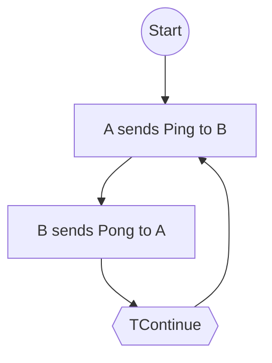

# Recursion in Multiparty Session Types (MPST)

## What is Recursion in MPST?

Recursion in multiparty session types (MPST) allows the specification of protocols that
repeat, loop, or have cyclic behavior. It enables the modeling of ongoing interactions,
such as repeated request-response cycles, streaming, or protocols with indefinite
lifetimes.

### Motivation

- Many real-world protocols require repeated or ongoing communication patterns.
- Recursion increases expressiveness, allowing protocols to specify loops and cycles.
- Examples: chat sessions, streaming, handshake retries, etc.

## Formal Definition (Implementation: TRec/EpRec)

A recursive protocol in MPST is defined using a *recursion label* and two constructs, each with explicit trait implementations:

- `TRec<label, S>` — Introduces a recursion point with a globally unique, non-empty label in the global protocol.

    ```rust
    pub struct TRec<IO, Lbl: types::ProtocolLabel, S: TSession<IO>>(PhantomData<(IO, Lbl, S)>);
    ```

  - `IO`: Protocol marker type (e.g., Http, Mqtt). Used to distinguish protocol families.
  - `Lbl`: Recursion label. Must be globally unique and non-empty. Propagated from global.
  - `S`: Continuation session after the recursion point (may refer to itself).

  - Implements the `TSession` trait and the `sealed` trait for global protocols.
- `TContinue<label>` — Jumps back to the recursion point labeled `label` in the global protocol.
  - Implements the `TSession` trait and the `sealed` trait for global protocols.

  ```rust
  pub struct TContinue<IO, Lbl: types::ProtocolLabel>(PhantomData<(IO, Lbl)>);
  ```

  - `IO`: Protocol marker type (e.g., Http, Mqtt).
  - `Lbl`: Recursion label. Must match the label of an enclosing `TRec`.

- `EpRec<label, Me, T>` — Local protocol recursion point (after projection), label faithfully propagated from global.

    ```rust
    pub struct EpRec<IO, Lbl: types::ProtocolLabel, Me, T>(PhantomData<(IO, Lbl, Me, T)>);
    ```

- `IO`: Protocol marker type (e.g., Http, Mqtt). Used to distinguish protocol families.
- `Lbl`: Recursion label. Must be globally unique and non-empty. Propagated from global.
- `Me`: The role for which this local protocol is defined.
- `T`: Continuation session after the recursion point (may refer to itself).

  - Implements the `EpSession` trait and the `sealed` trait for local protocols.

- `EpContinue<label, Me>` — Local continue, label matches the corresponding `EpRec`.

    ```rust
    pub struct EpContinue<IO, Lbl: types::ProtocolLabel, Me>(PhantomData<(IO, Lbl, Me)>);
    ```

- `IO`: Protocol marker type (e.g., Http, Mqtt).
- `Lbl`: Recursion label. Must match the label of an enclosing `EpRec`.
- `Me`: The role for which this local protocol is defined.

  - Implements the `EpSession` trait and the `sealed` trait for local protocols.

**Important:**

- Labels must be globally unique and non-empty. `TRec` is not allowed to have an empty label.
- The label is the only recursion variable; all references must use the label.
- All four types (`TRec`, `TContinue`, `EpRec`, `EpContinue`) are required to implement their respective session traits and the `sealed` trait to ensure type safety and protocol invariants at compile time.

**Syntax Example:**

```text
TRec<Loop, send A -> B: Msg; TContinue<Loop>>
```

This protocol means: "A sends a message to B, then the protocol repeats from the start, using the label `Loop`."

## Informal Example: Ping-Pong Protocol (with Labels)

A simple ping-pong protocol between roles `A` and `B`:

```text
global protocol PingPong(role A, role B) {
  TRec<Loop, {
    send A -> B: Ping;
    send B -> A: Pong;
    TContinue<Loop>;
  }>
}
```

- `A` sends `Ping` to `B`.
- `B` replies with `Pong` to `A`.
- The protocol repeats indefinitely, using the label `Loop`.

## Example: Global Protocol Definition Using `TRec`/`TContinue`

Below is the PingPong protocol defined using the Rust types described above:

```rust
use besedarium::protocol::global::{TRec, TContinue, TSend, TRecv, TEnd};
use besedarium::types::{ProtocolLabel, RoleA, RoleB, Ping, Pong, Loop};

// Define a unique label type for the recursion
pub struct Loop;
impl ProtocolLabel for Loop {}

// PingPong protocol: A sends Ping to B, B sends Pong to A, repeat
pub type PingPongProtocol = TRec<
    (), // IO marker (replace with your IO type)
    Loop,
    TSend<
        (), None, RoleA, Ping,
        TRecv<
            (), None, RoleB, Pong,
            TContinue<(), Loop>
        >
    >
>;
```

- This definition uses `TRec` to introduce the recursion point, and `TContinue` to loop back.
- The label `Loop` is defined as a Rust type and implements `ProtocolLabel`.
- The protocol alternates between sending and receiving, then recurses.

## Diagram: Recursive Protocol Structure (with Labels)



- The loop shows the recursive structure: after each round, the protocol returns to the start of the block labeled `Loop`.

## Key Points

- Recursion is defined using `TRec<label, ...>` and `TContinue<label>` (global), `EpRec<label, ...>` and `EpContinue<label>` (local).
- Labels must be globally unique and non-empty.
- Projections must propagate the label from global to local protocols without change.
- Recursive protocols must be carefully designed to ensure properties like deadlock-freedom and progress (see later sections).

---

## Specification and Implementation Variants of Recursion

### Specification: Global and Local Protocols

- **Global recursion** is specified using `TRec<label, ...>` and `TContinue<label>`.
- **Local recursion** (after projection) uses `EpRec<label, ...>` and `EpContinue<label>`, with the label faithfully propagated from the global protocol.
- **Scoping:**
  - Labels must be globally unique and non-empty.
  - `TContinue<label>`/`EpContinue<label>` must refer to an enclosing `TRec<label, ...>`/`EpRec<label, ...>`.

**Example: Global and Local Recursion (with Labels)**

```text
// Global
TRec<Loop, {
  send A -> B: Ping;
  send B -> A: Pong;
  TContinue<Loop>;
}>

// Local for A (after projection)
EpRec<Loop, {
  send B: Ping;
  recv B: Pong;
  EpContinue<Loop>;
}>
```

### Implementation in Rust

#### Type-Level Encoding

- Recursion is encoded using the Rust types and combinators defined above (`TRec`, `TContinue`, etc.), with explicit label types and trait bounds.
- The PingPong protocol example above demonstrates how to use these types to define a recursive protocol at the type level.
- All recursion and continuation points are tracked at the type level, ensuring compile-time safety and correct label propagation.
- The implementation enforces that labels are globally unique and non-empty, and that all combinators implement the required session and sealed traits.
- **Macros:**
  - Consider providing procedural or declarative macros to make recursive protocol definitions more ergonomic and less verbose.
  - Macros could automate repetitive type construction, enforce label uniqueness, and improve readability for complex protocols.
  - When designing macros, ensure:
    - Labels are generated or checked for uniqueness at macro expansion time.
    - Macro-generated code is fully type-checked and integrates with the trait system.
    - Macro syntax is clear and closely matches the protocol notation used in documentation.
  - Future macro support should be designed to integrate with both global and local protocol combinators, and to support nested recursion, choice, and parallel composition.

#### Value-Level (Runtime) Representation

- **Note:** The following is speculative and not yet designed or implemented in this codebase.
- Value-level (runtime) representation of recursive protocols could be approached in several ways:
  - **State Machine:** Implement the protocol as a state machine, where each state corresponds to a protocol combinator, and recursion is handled by looping or jumping to the appropriate state.
  - **Loop Constructs:** Use explicit loop constructs in the runtime logic to repeat protocol fragments as dictated by the type-level recursion.
  - **Dynamic Dispatch:** For highly dynamic protocols, trait objects or enums could be used to represent protocol states at runtime, with recursion handled by re-entering the appropriate state.
- The choice of runtime representation should be guided by performance, safety, and maintainability considerations, and should be designed to preserve the invariants established at the type level.

## Implementation Notes: Projection of Recursion

Projection is the process of translating a global protocol (using `TRec`/`TContinue`) into a local protocol (using `EpRec`/`EpContinue`) for a specific role.

- **Modularity:**
  - All helper functions for projecting recursion should be implemented in:
    - `src/protocol/transforms/rec.rs` (for recursion points)
    - `src/protocol/transforms/continue.rs` (for continue points)
  - This keeps the codebase modular and consistent with the structure used for other protocol combinators.

- **Pattern:**
  - The implementation should follow the established patterns for protocol projection in the library:
    - Use trait-based dispatch and helper traits for protocol combinator projection.
    - Ensure that label propagation and role-specific filtering are handled at the type level.
    - Maintain compositionality and extensibility for future protocol features.

- **Invariants to Preserve:**
  - Labels must be faithfully propagated from global to local protocols.
  - All recursion and continue points must be matched by label.
  - No label may be empty; all must be globally unique.
  - The structure of recursion must be preserved: every `TContinue<L>` must correspond to an enclosing `TRec<L, ...>`.
  - Projection must not introduce or remove recursion cycles.

- **Preconditions (for implementation and tests):**
  - The input global protocol must be well-formed:
    - All labels are unique and non-empty.
    - All `TContinue<L>` refer to a valid, enclosing `TRec<L, ...>`.
    - The protocol is type-correct and passes trait bounds.

- **Postconditions (for implementation and tests):**
  - The projected local protocol must:
    - Use `EpRec` and `EpContinue` with the same label as the global protocol.
    - Preserve the recursion structure and label mapping.
    - Be type-correct and pass all trait and label invariants.
    - Pass all protocol safety and deadlock-freedom checks established for the library.

- **Testing:**
  - Tests should cover:
    - Correct projection of recursion and continue points for all roles.
    - Label preservation and uniqueness.
    - Handling of nested and mutually recursive protocols.
    - Failure cases: missing labels, mismatched continue, or duplicate labels should be rejected at compile time.
